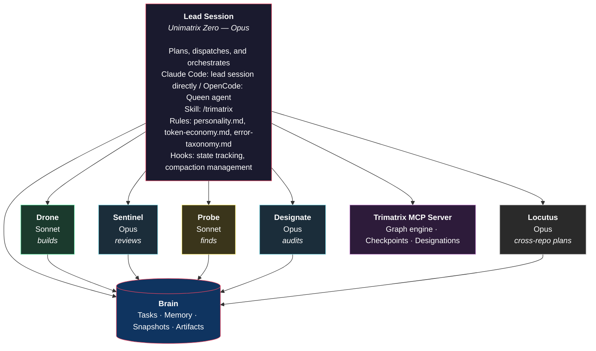
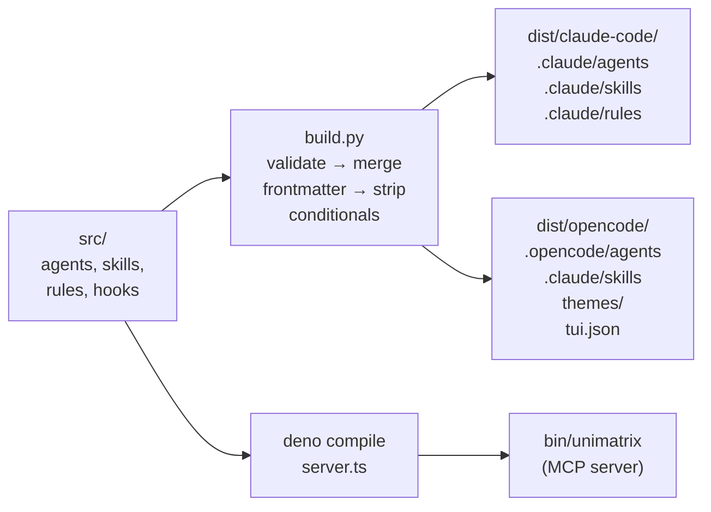
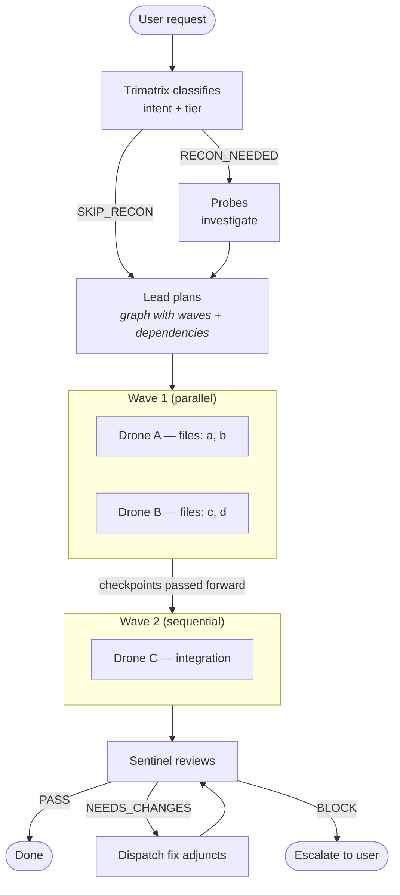
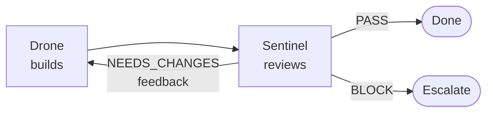
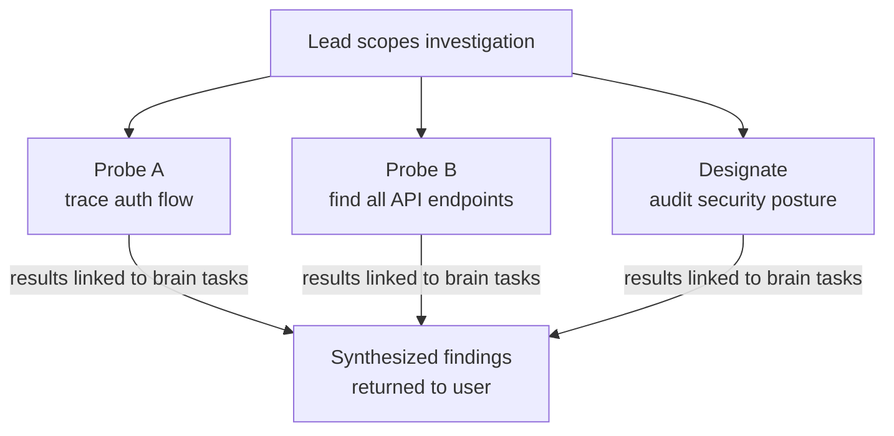
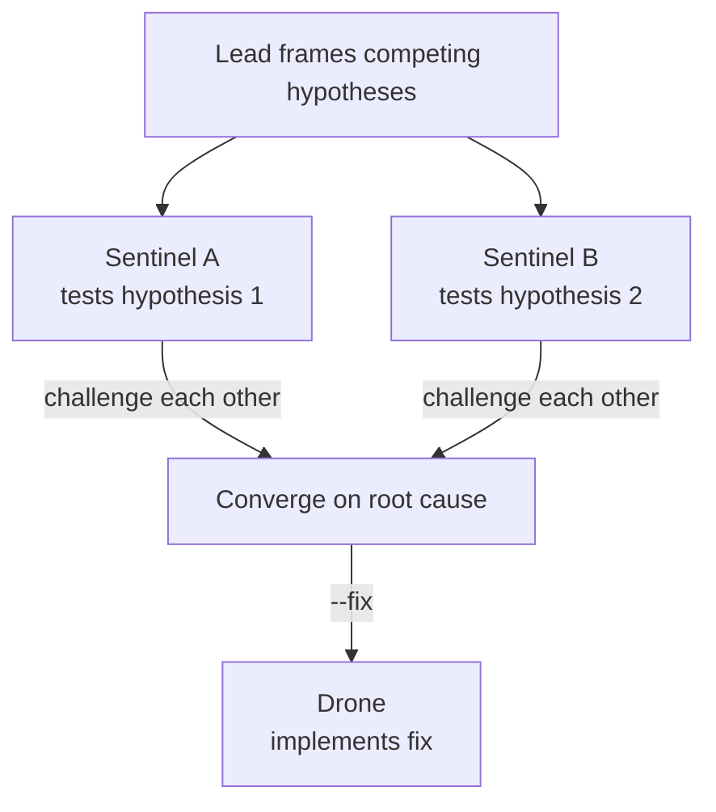
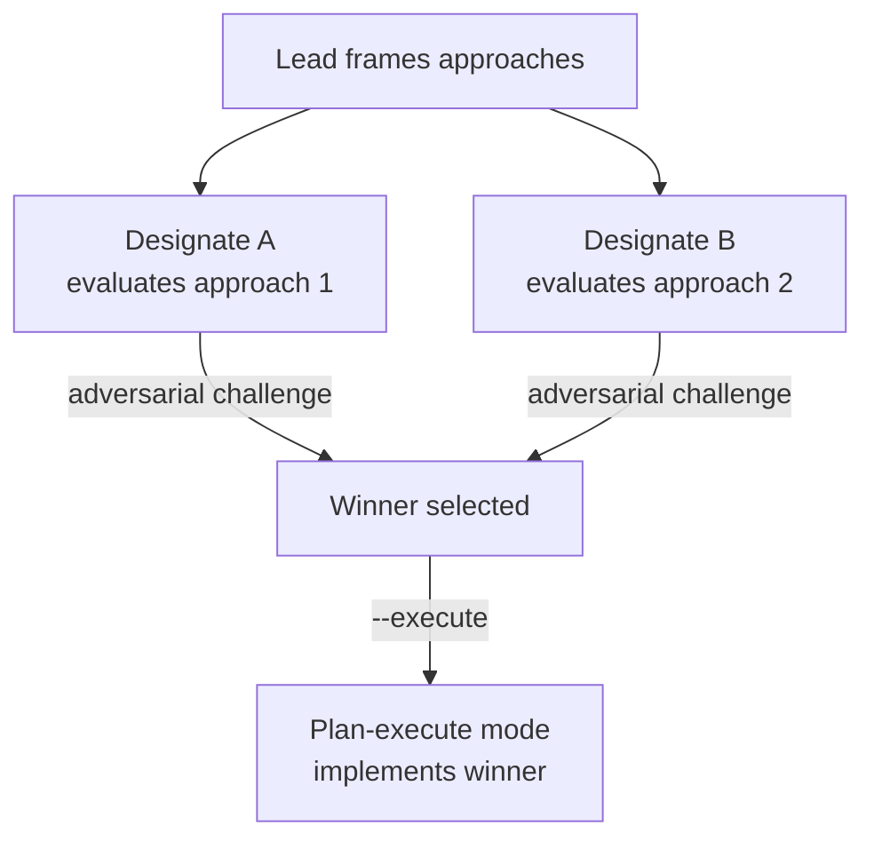
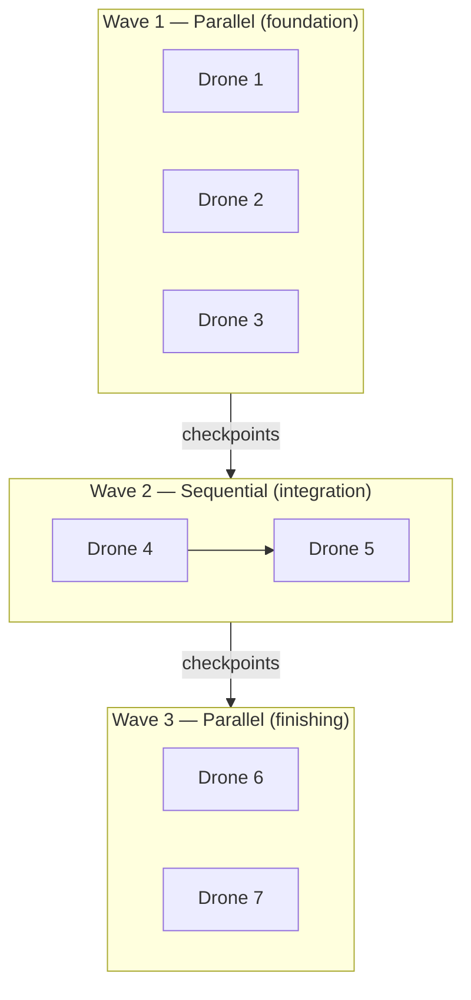

# Unimatrix

A multi-agent orchestration framework for [Claude Code](https://docs.anthropic.com/en/docs/claude-code) and [OpenCode](https://opencode.ai) that coordinates specialized AI agents to plan, implement, review, and analyze software engineering tasks. The project is distinctly **Star Trek Borg-themed** — agents are adjuncts of the collective, the lead session is the Borg Queen, and all terminology (assimilation, compliance, regeneration alcoves, etc.) reflects that aesthetic.

Unimatrix extends both platforms with a collective of agents — each with a distinct role, model, and set of capabilities — orchestrated through `/trimatrix`, event hooks, and persistent task tracking via [Brain](https://github.com/benediktms/brain).

## How It Works

Unimatrix follows a plan-execute-review cycle orchestrated by the trimatrix supergraph:


1. **The lead session plans** — classifies intent, decomposes into a graph of subtasks with dependencies, and computes execution waves
2. **The lead session dispatches** — spawns Drones (and optionally Probes/Designates) per wave
3. **Drones implement** — each executes a single well-scoped task, commits changes, and saves a checkpoint
4. **The Sentinel reviews** — validates correctness with evidence-based verification

All task state, checkpoints, and learned patterns are persisted in Brain, enabling work to be resumed across sessions.

## Architecture



### Agents

| Agent | Protocol | Model | Platform | Role |
|-------|----------|-------|----------|------|
| **Lead Session** | (direct) | Opus | Claude Code | Plans, dispatches, and orchestrates — the lead session itself |
| **Queen** | `queen-coordination-protocol` | Opus | OpenCode | Lead agent in OpenCode — strategic mind + direct execution |
| **Drone** | `drone-protocol` | Sonnet | Both | Implementation worker — executes a single well-scoped brain task, commits changes, saves checkpoints |
| **Sentinel** | `sentinel-protocol` | Opus | Both | Code reviewer — evidence-based verification with tiered reviews and verdicts (PASS/NEEDS_CHANGES/BLOCK) |
| **Probe** | `probe-protocol` | Sonnet | Both | Codebase scout — finds files, traces code paths, answers structural questions. Fast and shallow |
| **Designate** | `designate-protocol` | Opus | Both | Deep analyst — architectural audits, security reviews, performance analysis, codebase health. Slow and thorough |
| **Locutus** | `locutus-protocol` | Opus | Both | Cross-repo planning agent — analyzes foreign repositories, maps contracts and data flow, returns coordination plans. Plan-only — does not modify code |

Agent definitions live in `src/agents/` as markdown files with combined YAML frontmatter that configures platform-specific model, permission mode, max turns, and allowed/disallowed tools. See [FORMAT.md](./FORMAT.md) for the combined source format.

### Trimatrix Supergraph

All orchestration routes through a single unified skill: `/trimatrix`. Every prompt is classified by **intent** and **complexity tier**, then dispatched to the appropriate execution mode.

**Intents:**

| Intent | Triggers | Modes |
|--------|----------|-------|
| IMPLEMENT | Code changes, new features, refactoring | `plan-execute`, `adapt`, `swarm` |
| INVESTIGATE | "How does X work", "find Y", architectural questions | `investigate` |
| DIAGNOSE | Bug reports, "why does X happen" | `diagnose` |
| ARCHITECT | "Evaluate approaches for X", design decisions | `architect` |
| REVIEW | Code review requests, validation | `review` |
| REFACTOR | Structural cleanup, rename operations | `plan-execute`, `swarm` |
| RESUME | Continue prior work | Restores checkpoint, routes to original mode |

**Tiers:**

| Tier | Complexity | Strategy |
|------|-----------|----------|
| T1 | 1-2 files, clear spec | SELF — lead executes directly |
| T2 | 3-8 files, moderate | INDEPENDENT — adjuncts work in parallel |
| T3 | 9+ files, cross-cutting | COORDINATED — adjuncts + team coordination |

**Modes:**

| Mode | Description |
|------|-------------|
| `plan-execute` | Multi-file implementation with worktree isolation, wave dispatch, recon, review |
| `investigate` | Collaborative, independent, or deep investigation sub-modes |
| `diagnose` | Adversarial hypothesis testing via Sentinel team. `--fix` to implement |
| `architect` | Adversarial architecture evaluation. `--execute` hands winner to plan-execute |
| `review` | Code review — single adjunct or compliance matrix (`--matrix`) |
| `adapt` | Iterative implement-review loop until PASS (`--cycles N`, default 3, max 5) |
| `swarm` | File-partitioned bulk changes, max 5 partitions |
| `cross-repo` | Multi-repository feature execution with merge gates and per-node worktrees |

### Trimatrix MCP Server

The graph engine runs as an MCP server (`bin/unimatrix`), compiled from TypeScript source in `src/skills/trimatrix/`. It exposes 30 tools for graph lifecycle, node management, wave dispatch, checkpoint persistence, and agent designation generation.

Key tools: `init`, `add_node`, `add_edge`, `compute_waves`, `dispatch_wave`, `complete_node`, `save_checkpoint`, `restore_checkpoint`, `designate`, `status`.

The server is auto-compiled during installation via `just compile` (Deno compile → `bin/unimatrix`).

## Build System

Unimatrix uses a single set of source files in `src/` to generate platform-specific output for both Claude Code and OpenCode. The build system (`build.py`) processes combined YAML frontmatter and conditional body sections to produce the correct output per platform.



Source files use:
- **Combined frontmatter** — shared fields at the top level, platform-specific overrides in `claude:` / `opencode:` sections
- **Conditional body sections** — `<!-- @claude -->` ... `<!-- @end -->` and `<!-- @opencode -->` ... `<!-- @end -->` markers for platform-specific content
- **Platform filtering** — `platforms: [claude]` or `platforms: [opencode]` to restrict a file to one platform

See [FORMAT.md](./FORMAT.md) for the complete source format specification.

### Build Commands

```bash
python3 build.py --target all           # Build for both platforms (default)
python3 build.py --target claude        # Build for Claude Code only
python3 build.py --target opencode      # Build for OpenCode only
python3 build.py --validate             # Validate source files only
python3 build.py --clean                # Remove dist/ directory
python3 build.py --inject-tone [BRAIN]  # Inject Borg personality into a brain's AGENTS.md
```

Or use the [just](https://github.com/casey/just) command runner:

```bash
just build                # Build for both platforms
just build-claude         # Build for Claude Code only
just build-opencode       # Build for OpenCode only
just compile              # Compile the unimatrix MCP server binary
just validate             # Validate source files
just check                # Run all checks (Python lint + TS type-check + validation)
just check-py             # Lint Python files only
just check-ts             # Type-check OpenCode hook plugin only
just setup                # Install all dependencies (Python venv + Deno cache)
just venv                 # Create/refresh Python virtual environment
just install-global       # Build + compile + install both platforms globally
just install [path]       # Build + compile + install both platforms to a project
just install-claude [path]  # Build + compile + install Claude Code to a project
just install-opencode [path]  # Build + compile + install OpenCode to a project
just inject <brain-name>  # Inject Borg personality into a brain's AGENTS.md
just clean                # Remove dist/ directory
just clean-all            # Remove dist/ + .venv/
```

### Personality Injection

Unimatrix maintains a single source-of-truth personality guide (`src/rules/personality.md`) that all agents follow. To propagate this personality into registered brains' documentation:

```bash
python3 build.py --inject-tone <brain-name>   # Single brain
python3 build.py --inject-tone               # All registered brains
just inject <brain-name>
```

The injector:
- Discovers registered brains via `brain list --json`
- Locates or creates `<!-- unimatrix:tone:start -->` / `<!-- unimatrix:tone:end -->` markers in the brain's AGENTS.md
- Replaces the marked section with the current personality guidelines from `src/rules/personality.md`
- Skips the unimatrix brain itself (prevents self-injection)
- Idempotent — safe to run repeatedly

This ensures all projects using Unimatrix have consistent, up-to-date personality guidance for their AI agents.

## Installation

### Prerequisites

- [Claude Code](https://docs.anthropic.com/en/docs/claude-code) and/or [OpenCode](https://opencode.ai)
- [Brain](https://github.com/benediktms/brain) — task tracking, memory, and artifact persistence
- [mise](https://mise.jdx.dev/getting-started.html) — pins `just`, `python`, and `deno` at the versions in `.mise.toml`

### Install

```bash
git clone https://github.com/benediktms/unimatrix.git
cd unimatrix
mise install && just install-global
```

`mise install` provisions the pinned `just`, `python`, and `deno`. `just install-global` then builds, compiles the MCP server, and installs both platforms.

Restart your editor/CLI after installation to pick up changes.

### Smoke test

Verify the install with:

```bash
just check
```

Expected output (last line):

```
All source files valid.
```

Any failure here means the install is incomplete — usually a missing tool from `mise install` or a stale `dist/`.

### Advanced / per-project install

For per-platform or per-project installs, drive `install.sh` directly:

```bash
# Per-platform global installs
./install.sh --claude --global
./install.sh --opencode --global

# Per-project installs
./install.sh --claude --project ~/code/my-project
./install.sh --opencode --project ~/code/my-project
./install.sh --both --project ~/code/my-project
```

The installer:
- Runs `build.py` if `dist/` is missing or stale
- Compiles the trimatrix MCP server (`src/skills/trimatrix/server.ts` → `bin/unimatrix`) if missing or stale
- Symlinks `bin/unimatrix` to `~/bin/unimatrix`
- Symlinks `agents/` and `rules/` into the target config directory
- Symlinks individual skill subdirectories (preserves pre-existing skills in the target)
- Registers the unimatrix MCP server via `claude mcp add` (Claude Code only, idempotent)
- Merges Unimatrix settings (spinner verbs, status line, hooks) into your `settings.json` (Claude Code)
- Configures `core.hooksPath` for git hooks (Claude Code, unimatrix repo only)
- Symlinks OpenCode hook plugins into `.opencode/plugins/`
- Installs Borg TUI theme to `~/.config/opencode/themes/` and TUI config to `~/.config/opencode/tui.json` (OpenCode global only)
- Backs up existing files before overwriting
- Cleans up stale symlinks from previous installs
- Skips project-level `.claude/skills/` when installing OpenCode to the unimatrix repo itself (if Claude Code skills are already installed globally) to prevent duplicate skills

## Workflows

All workflows route through `/trimatrix`. The intent classifier determines the mode automatically based on the prompt.

### Plan-Execute

The primary workflow for complex, multi-step tasks:



### Adapt

For tasks that need multiple passes to converge:



### Swarm

For applying the same kind of change across many files:


### Investigate

For understanding a codebase area before making changes:



### Diagnose

For bugs with unclear root cause — adversarial hypothesis testing:



### Architect

For evaluating competing architectural approaches:



## Brain Integration

[Brain](https://github.com/benediktms/brain) is the persistence layer that enables coordination across agents and sessions. Unimatrix uses Brain for three core functions:

### Task Management

Brain tracks all work as tasks with dependencies, priorities, and status:

```
Epic: "Implement auth system"
├── Task 1: "Add JWT middleware" (ready)
├── Task 2: "Create login endpoint" (blocked by 1)
├── Task 3: "Add session store" (blocked by 1)
└── Task 4: "Integration tests" (blocked by 2, 3)
```

- The **lead session** creates epics and subtasks with dependencies via `tasks_apply_event`
- **Drones** mark tasks `in_progress`, add comments, and report completion
- `tasks_next` returns the highest-priority unblocked tasks
- `tasks_close` closes completed tasks and unblocks dependents

### Snapshots and Artifacts

Brain stores checkpoints and artifacts that enable context flow between agents:

| What | Who Creates | Purpose | Tags |
|------|-------------|---------|------|
| Adjunct checkpoints | Drone | Pass context to subsequent waves | `drone-checkpoint`, `parent:<task-id>` |
| Implementation artifacts | Drone | Permanent record of what changed | `drone-implementation` |
| Lead plans | Lead | Plan record before execution | `queen-plan` |
| Reconnaissance findings | Probe | Recon results linked to tasks | `probe-recon` |
| Analysis reports | Designate | Structured analysis reports | `cortex-analysis` |
| Review verdicts | Sentinel | Review verdicts and evidence | `vinculum-review` |

**Cross-wave context flow:** When adjuncts in Wave 1 complete, the lead extracts their snapshot IDs and passes them to Wave 2 adjuncts via `PRIOR CHECKPOINTS: <id1>, <id2>` in the prompt. This enables context handoff without the lead relaying full file contents.

### Memory

Brain's semantic memory enables knowledge persistence across sessions:

- `memory_write_episode` — Records structured episodes (goal, actions, outcome) with tags and importance
- `memory_search_minimal` — Semantic search with intent-aware ranking (lookup, planning, reflection, synthesis)
- `memory_expand` — Fetches full content from search stubs

## Hooks

Unimatrix hooks into platform event systems for automatic state management. Claude Code hooks are Python scripts in `src/hooks/claude/`. OpenCode hooks are TypeScript plugins in `src/hooks/opencode/`. Both implementations follow the shared logic defined in `src/hooks/SPEC.md`.

### State Tracking

| Hook | Event | Purpose |
|------|-------|---------|
| `track-agents.py` | SubagentStart/Stop | Tracks active subagents per session (type, duration, count) |
| `track-cost.py` | SubagentStop | Parses transcripts for token usage, calculates cost per agent tier |
| `track-compactions.py` | PreCompact | Counts context window compactions per session |

### Compaction Management

Claude Code compacts (summarizes) the conversation when the context window fills up. Unimatrix preserves critical state across compactions:

| Hook | Event | Purpose |
|------|-------|---------|
| `warn-compaction.py` | PostToolUse | Estimates token usage and warns at 70%/85% thresholds before compaction hits |

### Git Hooks

| Hook | Event | Purpose |
|------|-------|---------|
| `pre-commit` | Git pre-commit | Announces assimilation in progress |
| `post-commit` | Git post-commit | Re-runs `install.sh --both --global` to keep symlinks in sync after changes |

### Status Line

`src/shared/statusline.py` renders a custom Claude Code status line showing active agents (color-coded by type), elapsed durations, compaction count, and session cost.

## Coordination Patterns

### Parallel Execution

When plan steps are independent, multiple adjuncts run simultaneously:

- **File-partitioned:** Each adjunct gets a non-overlapping set of files. No worktree isolation needed — all commit directly to the current branch.
- **Worktree-isolated:** When adjuncts might touch overlapping files, each runs in an isolated git worktree. The lead squash-merges branches between waves.

### Sequential Execution

When steps have dependencies, adjuncts run one at a time. Prior checkpoint IDs flow forward via `PRIOR CHECKPOINTS:` in the prompt.

### Sequence Relay

For long sequential chains (3+ steps), each adjunct saves a handoff snapshot and the next adjunct receives only the handoff as prior context — avoiding lead session compaction in long chains.

### Mixed-Mode

Most real plans mix both: parallel foundation waves, sequential integration steps, parallel finishing work. The trimatrix graph engine computes optimal wave ordering automatically.



### Error Handling

- If an adjunct fails, it marks the task `blocked` and reports to the lead
- The lead does not retry with the same approach — it escalates to the user
- If the Sentinel finds critical issues, the lead dispatches new adjuncts with specific fix instructions

## Project Structure

```
unimatrix/
├── src/                          # Combined source (human-authored)
│   ├── agents/                   # Agent definitions (combined frontmatter)
│   │   ├── queen-coordination-protocol.md    # Lead agent (OpenCode only)
│   │   ├── drone-protocol.md                 # Implementation worker
│   │   ├── sentinel-protocol.md              # Code reviewer
│   │   ├── probe-protocol.md                 # Codebase scout
│   │   ├── designate-protocol.md             # Deep analyst
│   │   └── locutus-protocol.md               # Cleanup worker
│   ├── skills/                   # Slash command skills
│   │   └── trimatrix/            # Unified orchestration supergraph
│   │       ├── SKILL.md          #   Skill definition + intent classifier + protocols
│   │       ├── CROSS-REPO.md     #   Cross-repo MCP tool reference
│   │       ├── server.ts         #   MCP server (graph engine, checkpoints, designations)
│   │       ├── graph.ts          #   Graph data structure + wave computation
│   │       ├── state.ts          #   State machine + checkpoint management
│   │       ├── types.ts          #   TypeScript type definitions
│   │       ├── brain-sync.ts     #   Brain task synchronization
│   │       ├── designate.ts      #   Borg designation generation
│   │       ├── side-effect-runner.ts  # Side effect execution
│   │       ├── side-effect-policy.ts  # Side effect policies
│   │       ├── modes/            #   Execution mode definitions
│   │       │   ├── plan-execute.md   # Multi-file implementation
│   │       │   ├── investigate.md    # Codebase investigation
│   │       │   ├── diagnose.md       # Adversarial bug diagnosis
│   │       │   ├── architect.md      # Architecture evaluation
│   │       │   ├── review.md         # Code review
│   │       │   ├── adapt.md          # Iterative refinement
│   │       │   ├── swarm.md          # Parallel bulk changes
│   │       │   └── cross-repo.md     # Multi-repository execution
│   │       └── *.test.ts         #   Test files
│   ├── rules/                    # Process rules
│   │   ├── personality.md        #   Borg collective personality guidelines (source of truth)
│   │   ├── token-economy.md      #   Token-efficient agent behavior
│   │   └── error-taxonomy.md     #   Borg error designations for failure reporting
│   ├── hooks/                    # Platform-specific event hooks
│   │   ├── claude/               #   Python/Shell hooks (Claude Code)
│   │   │   ├── warn-compaction.py
│   │   │   ├── track-agents.py
│   │   │   ├── track-cost.py
│   │   │   ├── track-compactions.py
│   │   │   ├── pre-commit
│   │   │   └── post-commit
│   │   ├── opencode/             #   TypeScript plugin (OpenCode)
│   │   │   └── unimatrix-hooks.ts
│   │   └── SPEC.md               #   Shared hook logic specification
│   ├── themes/                   #   OpenCode TUI themes
│   │   ├── unimatrix.json        #     Borg green-on-dark (default)
│   │   ├── unimatrix-zero.json   #     Soft dreamlike greens
│   │   ├── queens-chamber.json   #     Deep purple/violet
│   │   ├── tactical-cube.json    #     Aggressive red-shifted
│   │   └── unicomplex.json       #     Gold/amber central hub
│   ├── tui/                      #   OpenCode TUI configuration
│   │   └── tui.json              #     Theme, scroll, diff settings
│   └── shared/                   #   Platform-agnostic assets
│       ├── statusline.py         #     Claude Code status line
│       └── statusline.sh         #     Shell status line helper
├── bin/                          # Compiled binaries
│   └── unimatrix                 #   Compiled MCP server (Deno → binary)
├── dist/                         # Generated output (gitignored)
│   ├── claude-code/              #   Claude Code-specific output
│   │   └── .claude/
│   │       ├── agents/*.md
│   │       ├── skills/trimatrix/SKILL.md
│   │       └── rules/*.md
│   └── opencode/                 #   OpenCode-specific output
│       ├── .opencode/
│       │   └── agents/*.md
│       ├── .claude/
│       │   └── skills/trimatrix/SKILL.md
│       ├── themes/
│       │   └── unimatrix.json
│       └── tui.json
├── build.py                      # Build system — generates dist/ from src/
├── install.sh                    # Dual-platform symlink installer
├── settings.json                 # Claude Code settings template
├── justfile                      # Task runner (just)
├── pyproject.toml                # Python project config
├── deno.json                     # Deno config (MCP server + OpenCode TS hooks)
├── AGENTS.md                     # Canonical agent reference (includes task management docs)
├── CLAUDE.md                     # Project entry point for Claude Code
├── FORMAT.md                     # Combined source format specification
└── VALIDATION.md                 # Dual-platform validation checklist
```

## Themes

Unimatrix ships 5 Borg-aesthetic TUI themes for OpenCode. Themes are installed to `~/.config/opencode/themes/` during global installation.

| Theme | Description |
|-------|-------------|
| `unimatrix` | Borg green-on-dark — the default collective aesthetic |
| `unimatrix-zero` | Soft dreamlike greens — Unimatrix Zero's subconscious drift |
| `queens-chamber` | Deep purple/violet — the Queen's sovereign aesthetic |
| `tactical-cube` | Aggressive red-shifted — crimson plasma of the combat cube |
| `unicomplex` | Gold/amber — the warm glow of the central hub |

To switch themes, edit `src/tui/tui.json` and change the `"theme"` value to any of the names above, then rebuild:

```bash
just build
# or install directly
./install.sh --opencode --global
```

## Configuration

### `settings.json`

Merged into Claude Code's settings during installation. Configures:

- **Hooks** — Maps Claude Code events to hook scripts (`SubagentStart/Stop`, `PreCompact`, `PostToolUse`)
- **Spinner verbs** — Custom Borg-themed loading messages
- **Status line** — Points to `statusline.py` for the custom status bar

### Agent Definitions

Each agent file (`src/agents/*.md`) uses combined YAML frontmatter with shared and platform-specific sections:

```yaml
---
model: sonnet
description: "Worker agent — implements a single well-defined task"

claude:
  name: Drone
  permissionMode: bypassPermissions
  disallowedTools: [Agent]
  maxTurns: 50

opencode:
  mode: subagent
  steps: 50
  permission:
    "*": allow
  tools:
    task: false
---
```

### Skill Definitions

Each skill file (`src/skills/*/SKILL.md`) uses YAML frontmatter:

```yaml
---
description: "Short description shown in /help"
user_invocable: true
---
```

The markdown body contains the full prompt that executes when the skill is invoked. Platform-specific dispatch syntax uses conditional sections (`<!-- @claude -->` / `<!-- @opencode -->`).

## Further Reading

- [AGENTS.md](./AGENTS.md) — Canonical agent reference with task management CLI/MCP documentation
- [FORMAT.md](./FORMAT.md) — Combined source format specification for dual-platform builds
- [VALIDATION.md](./VALIDATION.md) — Dual-platform validation checklist
- [Brain](https://github.com/benediktms/brain) — The task tracking, memory, and artifact persistence backend
- [Claude Code](https://docs.anthropic.com/en/docs/claude-code) — The CLI that Unimatrix extends
- [OpenCode](https://opencode.ai) — The alternative AI coding tool that Unimatrix supports
