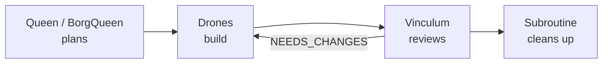
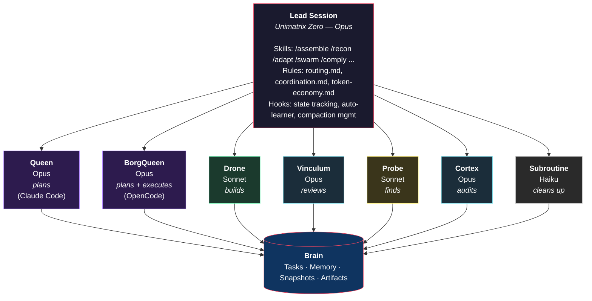
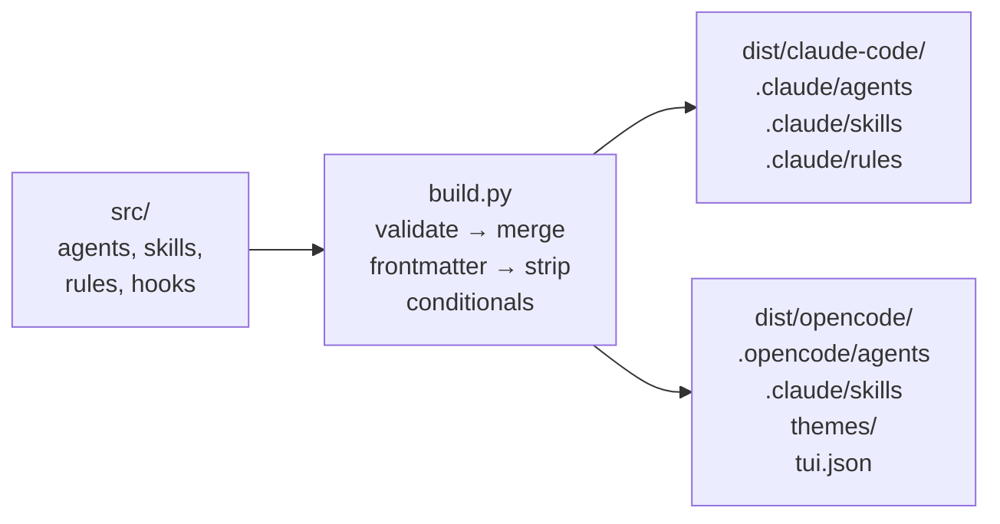
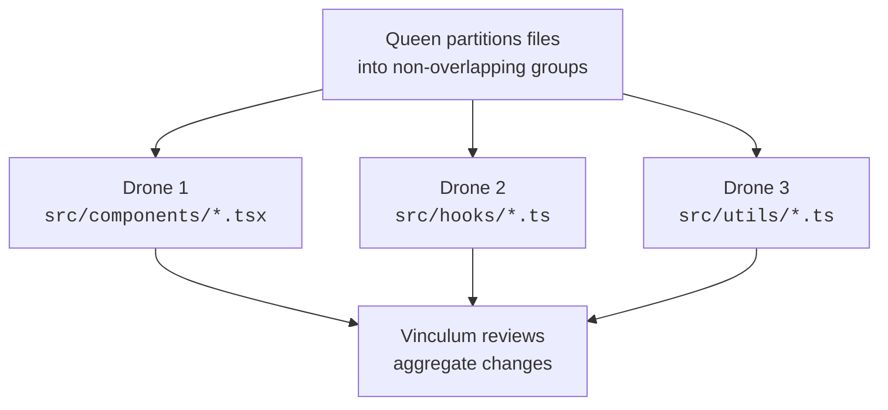
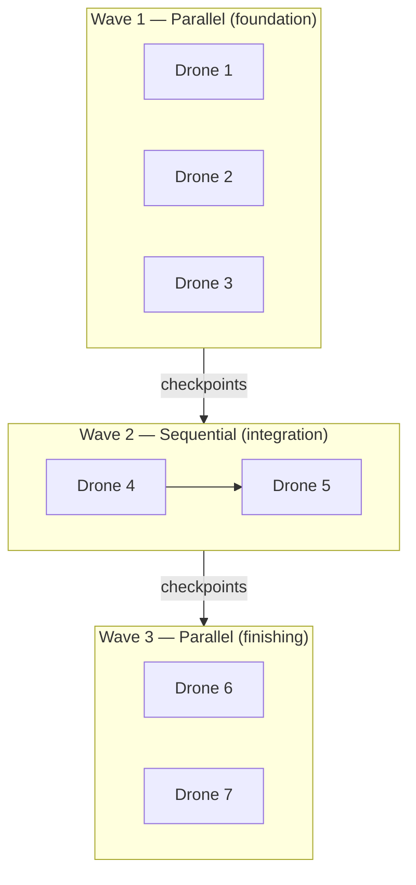

# Unimatrix

A multi-agent orchestration framework for [Claude Code](https://docs.anthropic.com/en/docs/claude-code) and [OpenCode](https://opencode.ai) that coordinates specialized AI agents to plan, implement, review, and analyze software engineering tasks.

Unimatrix extends both platforms with a collective of agents — each with a distinct role, model, and set of capabilities — orchestrated through slash commands, event hooks, and persistent task tracking via [Brain](https://github.com/benediktms/brain).

## How It Works

Unimatrix follows a plan-execute-review cycle:



1. **The Queen plans** (Claude Code) or **BorgQueen plans directly** (OpenCode) — decomposes a task into subtasks, sets dependencies, and produces a dispatch plan
2. **The lead session orchestrates** — spawns Drones (and optionally Probes/Cortex) to carry out the plan
3. **Drones implement** — each executes a single well-scoped task, commits changes, and saves a checkpoint
4. **The Vinculum reviews** — validates correctness with evidence-based verification
5. **The Subroutine cleans up** — commits, closes tasks, writes memory episodes

All task state, checkpoints, and learned patterns are persisted in Brain, enabling work to be resumed across sessions.

## Architecture



### Agents

| Agent | Model | Platform | Role |
|-------|-------|----------|------|
| **Queen** | Opus | Claude Code | Strategic planner — decomposes work into brain tasks with dependencies, produces dispatch plans |
| **BorgQueen** | Opus | OpenCode | Lead agent — strategic planner with direct execution capabilities |
| **Drone** | Sonnet | Both | Implementation worker — executes a single well-scoped brain task, commits changes, saves checkpoints |
| **Vinculum** | Opus | Both | Code reviewer — evidence-based verification with tiered reviews (Quick/Standard/Deep) and verdicts (PASS/NEEDS_CHANGES/BLOCK) |
| **Probe** | Sonnet | Both | Codebase scout — finds files, traces code paths, answers structural questions. Fast and shallow |
| **Cortex** | Opus | Both | Deep analyst — architectural audits, security reviews, performance analysis, codebase health. Slow and thorough |
| **Subroutine** | Haiku | Both | Cleanup worker — git commits, documentation sync, brain task closure. Executes explicit instructions only |

Agent definitions live in `src/agents/` as markdown files with combined YAML frontmatter that configures platform-specific model, permission mode, max turns, and allowed/disallowed tools. See [FORMAT.md](./FORMAT.md) for the combined source format.

### Skills (Slash Commands)

Skills are the primary interface for invoking workflows:

| Skill | Description |
|-------|-------------|
| `/assemble` | End-to-end orchestration: Queen plans, Drones implement (parallel or sequential waves), Vinculum reviews |
| `/recon` | Reconnaissance and feature planning: recon team self-claims brain tasks, shares discoveries in real-time. `--plan` for iterative feature scoping |
| `/adapt` | Iterative refinement loop: Drone implements, Vinculum reviews, repeat until PASS (default 3 cycles, max 5) |
| `/swarm` | Bulk parallel changes: Queen partitions files into groups (max 5), Drones work in parallel on non-overlapping partitions |
| `/comply` | Code review: invokes Vinculum on uncommitted changes, a branch, a file path, or a brain task |
| `/analyse` | Deep analysis: invokes Cortex for architectural audits, security reviews, or codebase health assessments |
| `/propagate` | Run `/assemble` in an isolated worktree on a fresh branch — review and merge when ready |
| `/reengage` | Resume a previously planned brain task |
| `/assimilate` | End-of-session ritual: captures knowledge, writes memory episodes, prepares context for next session |
| `/harvest` | Session knowledge extraction: Probe-style scan of exploration findings, Cortex deduplicates and persists as brain records/memory |
| `/bisect` | Guided binary search through commits: automated (`--test`) or AI-guided with Probe analysis, runs in worktree |
| `/bookmark` | Save a named checkpoint of current work state — branch, tasks, changes, next steps — for later resumption |
| `/resume` | Restore context from a saved bookmark: staleness detection, task status diff, structured briefing |
| `/designate` | Generates Borg-style agent designations (e.g., "Seven of Nine, Septenary Tactical Adjunct of Trimatrix 712") |
| `/status` | Displays session status — active agents, elapsed time, cost, and compaction count |

Skill definitions live in `src/skills/<name>/SKILL.md`.

## Build System

Unimatrix uses a single set of source files in `src/` to generate platform-specific output for both Claude Code and OpenCode. The build system (`build.py`) processes combined YAML frontmatter and conditional body sections to produce the correct output per platform.



Source files use:
- **Combined frontmatter** — shared fields at the top level, platform-specific overrides in `claude:` / `opencode:` sections
- **Conditional body sections** — `<!-- @claude -->` ... `<!-- @end -->` and `<!-- @opencode -->` ... `<!-- @end -->` markers for platform-specific content
- **Platform filtering** — `platforms: [claude]` or `platforms: [opencode]` to restrict a file to one platform

See [FORMAT.md](./FORMAT.md) for the complete source format specification.

### Build Commands

```bash
python3 build.py --target all           # Build for both platforms (default)
python3 build.py --target claude        # Build for Claude Code only
python3 build.py --target opencode      # Build for OpenCode only
python3 build.py --validate             # Validate source files only
python3 build.py --clean                # Remove dist/ directory
python3 build.py --inject-tone [BRAIN]  # Inject Borg personality into a brain's AGENTS.md
```

Or use the [just](https://github.com/casey/just) command runner:

```bash
just build                # Build for both platforms
just build-claude         # Build for Claude Code only
just build-opencode       # Build for OpenCode only
just validate             # Validate source files
just check                # Run all checks (Python lint + TS type-check + validation)
just install-global       # Build + install both platforms globally
just install <path>       # Build + install both platforms to a project
just inject <brain-name>  # Inject Borg personality into a brain's AGENTS.md
```

### Personality Injection

Unimatrix maintains a single source-of-truth personality guide (`src/rules/personality.md`) that all agents follow. To propagate this personality into registered brains' documentation:

```bash
python3 build.py --inject-tone <brain-name>
just inject <brain-name>
```

The injector:
- Discovers registered brains via `brain list --json`
- Locates or creates `<!-- unimatrix:tone:start -->` / `<!-- unimatrix:tone:end -->` markers in the brain's AGENTS.md
- Replaces the marked section with the current personality guidelines from `src/rules/personality.md`
- Skips the unimatrix brain itself (prevents self-injection)
- Idempotent — safe to run repeatedly

This ensures all projects using Unimatrix have consistent, up-to-date personality guidance for their AI agents.

## Installation

### Prerequisites

- [Claude Code](https://docs.anthropic.com/en/docs/claude-code) and/or [OpenCode](https://opencode.ai)
- [Brain](https://github.com/benediktms/brain) — task tracking, memory, and artifact persistence
- Python 3.12+ (for build system and hooks)
- [Deno](https://deno.com) (for OpenCode hook type-checking, optional)

### Install

```bash
# Clone the repository
git clone https://github.com/benediktms/unimatrix.git

# Set up dependencies
just setup                # or: python3 -m venv .venv && pip install -e .

# Build and install globally for both platforms
just install-global

# Or install per-platform
./install.sh --claude --global
./install.sh --opencode --global

# Per-project installation
./install.sh --claude --project ~/code/my-project
./install.sh --opencode --project ~/code/my-project
./install.sh --both --project ~/code/my-project
```

The installer:
- Runs `build.py` if `dist/` is missing or stale
- Symlinks `agents/`, `rules/`, and `skills/` into the target config directory
- Merges Unimatrix settings (spinner verbs, status line, hooks) into your `settings.json` (Claude Code)
- Configures `core.hooksPath` for git hooks (Claude Code)
- Symlinks OpenCode hook plugins into `.opencode/plugins/`
- Installs Borg TUI theme to `~/.config/opencode/themes/` and TUI config to `~/.config/opencode/tui.json` (OpenCode global only)
- Backs up existing files before overwriting
- Cleans up stale symlinks from previous installs
- Skips project-level `.claude/skills/` when installing OpenCode to the unimatrix repo itself (if Claude Code skills are already installed globally) to prevent duplicate skills

Restart your editor/CLI after installation to pick up changes.

## Workflows

### `/assemble` — Full Orchestration

The primary workflow for complex, multi-step tasks:


### `/adapt` — Iterative Refinement

For tasks that need multiple passes to converge:


### `/swarm` — Parallel Bulk Changes

For applying the same kind of change across many files:



### `/recon` — Reconnaissance

For understanding a codebase area before making changes:


## Brain Integration

[Brain](https://github.com/benediktms/brain) is the persistence layer that enables coordination across agents and sessions. Unimatrix uses Brain for three core functions:

### Task Management

Brain tracks all work as tasks with dependencies, priorities, and status:

```
Epic: "Implement auth system"
├── Task 1: "Add JWT middleware" (ready)
├── Task 2: "Create login endpoint" (blocked by 1)
├── Task 3: "Add session store" (blocked by 1)
└── Task 4: "Integration tests" (blocked by 2, 3)
```

- The **Queen** creates epics and subtasks with dependencies via `tasks_apply_event`
- **Drones** mark tasks `in_progress`, add comments, and report completion
- `tasks_next` returns the highest-priority unblocked tasks
- `tasks_close` closes completed tasks and unblocks dependents

### Snapshots and Artifacts

Brain stores checkpoints and artifacts that enable context flow between agents:

| What | Who Creates | Purpose | Tags |
|------|-------------|---------|------|
| Drone checkpoints | Drone | Pass context to subsequent waves | `drone-checkpoint`, `parent:<task-id>` |
| Implementation artifacts | Drone | Permanent record of what changed | `drone-implementation` |
| Queen plans | Queen | Plan record before execution | `queen-plan` |
| Probe findings | Probe | Recon results linked to tasks | `probe-recon` |
| Cortex analyses | Cortex | Structured analysis reports | `cortex-analysis` |
| Vinculum reviews | Vinculum | Review verdicts and evidence | `vinculum-review` |

**Cross-wave context flow:** When Drones in Wave 1 complete, the lead extracts their snapshot IDs and passes them to Wave 2 Drones via `PRIOR CHECKPOINTS: <id1>, <id2>` in the prompt. This enables context handoff without the lead relaying full file contents.

### Memory

Brain's semantic memory enables knowledge persistence across sessions:

- `memory_write_episode` — Records structured episodes (goal, actions, outcome) with tags and importance
- `memory_search_minimal` — Semantic search with intent-aware ranking (lookup, planning, reflection, synthesis)
- `memory_expand` — Fetches full content from search stubs

The auto-learner system (see Hooks below) uses memory to capture and replay error/fix patterns automatically.

## Hooks

Unimatrix hooks into platform event systems for automatic state management. Claude Code hooks are Python scripts in `src/hooks/claude/`. OpenCode hooks are TypeScript plugins in `src/hooks/opencode/`. Both implementations follow the shared logic defined in `src/hooks/SPEC.md`.

### State Tracking

| Hook | Event | Purpose |
|------|-------|---------|
| `track-agents.py` | SubagentStart/Stop | Tracks active subagents per session (type, duration, count) |
| `track-cost.py` | SubagentStop | Parses transcripts for token usage, calculates cost per agent tier |
| `track-compactions.py` | PreCompact | Counts context window compactions per session |

### Compaction Management

Claude Code compacts (summarizes) the conversation when the context window fills up. Unimatrix preserves critical state across compactions:

| Hook | Event | Purpose |
|------|-------|---------|
| `checkpoint-state.py` | PreCompact | Captures open tasks, active agents, and costs; saves as brain snapshot and temp file |
| `inject-checkpoint.py` | UserPromptSubmit | Injects the saved checkpoint into the next prompt after compaction (one-shot) |
| `warn-compaction.py` | PostToolUse | Estimates token usage and warns at 70%/85% thresholds before compaction hits |

### Auto-Learner

The auto-learner captures error/fix patterns and replays them in future sessions:

| Hook | Event | Purpose |
|------|-------|---------|
| `learner-track.py` | PostToolUse | Detects tool failures, then watches for successful follow-ups. Scores error/fix pairs and persists high-confidence patterns to brain memory |
| `learner-inject.py` | UserPromptSubmit | Searches brain for auto-learned patterns matching pending errors, injects matching fixes as context |

### Other

| Hook | Event | Purpose |
|------|-------|---------|
| `post-commit` | Git post-commit | Re-runs `install.sh --global` to keep symlinks in sync after changes |

### Status Line

`src/shared/statusline.py` renders a custom Claude Code status line showing active agents (color-coded by type), elapsed durations, compaction count, and session cost.

## Coordination Patterns

### Parallel Execution

When plan steps are independent, multiple Drones run simultaneously:

- **File-partitioned:** Each Drone gets a non-overlapping set of files. No worktree isolation needed — all commit directly to the current branch.
- **Worktree-isolated:** When Drones might touch overlapping files, each runs in an isolated git worktree. The lead squash-merges branches between waves.

### Sequential Execution

When steps have dependencies, Drones run one at a time. Prior checkpoint IDs flow forward via `PRIOR CHECKPOINTS:` in the prompt.

### Sequence Relay

For long sequential chains (3+ steps), each Drone saves a handoff snapshot and the next Drone receives only the handoff as prior context — avoiding queen compaction in long chains.

### Mixed-Mode

Most real plans mix both: parallel foundation waves, sequential integration steps, parallel finishing work. The Queen's dispatch plan specifies the wave structure.



### Error Handling

- If a Drone fails, it marks the task `blocked` and reports to the lead
- The lead does not retry with the same approach — it escalates to the user
- If the Vinculum finds critical issues, the lead dispatches new Drones with specific fix instructions

## Project Structure

```
unimatrix/
├── src/                          # Combined source (human-authored)
│   ├── agents/                   # Agent definitions (combined frontmatter)
│   │   ├── queen.md              #   Strategic planner — Claude Code only
│   │   ├── borgqueen.md          #   Lead agent — OpenCode only
│   │   ├── drone.md              #   Implementation worker
│   │   ├── vinculum.md           #   Code reviewer
│   │   ├── probe.md              #   Codebase scout
│   │   ├── cortex.md             #   Deep analyst
│   │   └── subroutine.md         #   Cleanup worker
│   ├── skills/                   # Slash command skills
│   │   ├── assemble/SKILL.md     #   End-to-end orchestration
│   │   ├── adapt/SKILL.md        #   Iterative refinement
│   │   ├── swarm/SKILL.md        #   Parallel bulk changes
│   │   ├── recon/SKILL.md        #   Reconnaissance and feature planning
│   │   ├── propagate/SKILL.md    #   Worktree-isolated orchestration
│   │   ├── comply/SKILL.md       #   Code review
│   │   ├── analyse/SKILL.md      #   Deep analysis
│   │   ├── reengage/SKILL.md     #   Resume prior work
│   │   ├── assimilate/SKILL.md   #   End-of-session cleanup
│   │   ├── harvest/SKILL.md      #   Session knowledge extraction
│   │   ├── bisect/SKILL.md       #   Guided commit binary search
│   │   ├── bookmark/SKILL.md     #   Save work checkpoints
│   │   ├── resume/SKILL.md       #   Restore from bookmarks
│   │   ├── designate/SKILL.md    #   Agent naming
│   │   └── status/SKILL.md       #   Session status display
│   ├── rules/                    # Process rules
│   │   ├── personality.md        #   Borg collective personality guidelines (source of truth)
│   │   ├── routing.md            #   Task → agent routing decisions
│   │   ├── coordination.md       #   Multi-agent coordination patterns
│   │   └── token-economy.md      #   Token-efficient agent behavior
│   ├── hooks/                    # Platform-specific event hooks
│   │   ├── claude/               #   Python/Shell hooks (Claude Code)
│   │   │   ├── checkpoint-state.py
│   │   │   ├── inject-checkpoint.py
│   │   │   ├── warn-compaction.py
│   │   │   ├── learner-track.py
│   │   │   ├── learner-inject.py
│   │   │   ├── track-agents.py
│   │   │   ├── track-cost.py
│   │   │   ├── track-compactions.py
│   │   │   ├── designate.py
│   │   │   └── post-commit
│   │   ├── opencode/             #   TypeScript plugin (OpenCode)
│   │   │   └── unimatrix-hooks.ts
│   │   └── SPEC.md               #   Shared hook logic specification
│   ├── themes/                   #   OpenCode TUI themes
│   │   ├── unimatrix.json        #     Borg green-on-dark (default)
│   │   ├── unimatrix-zero.json   #     Soft dreamlike greens
│   │   ├── queens-chamber.json   #     Deep purple/violet
│   │   ├── tactical-cube.json    #     Aggressive red-shifted
│   │   └── unicomplex.json       #     Gold/amber central hub
│   ├── tui/                      #   OpenCode TUI configuration
│   │   └── tui.json              #     Theme, scroll, diff settings
│   ├── shared/                   #   Platform-agnostic assets
│   │   ├── statusline.py         #     Claude Code status line
│   │   └── statusline.sh         #     Shell status line helper
│   └── lead/                     #   Lead session prompt templates
├── dist/                         # Generated output (gitignored)
│   ├── claude-code/              #   Claude Code-specific output
│   │   └── .claude/
│   │       ├── agents/*.md
│   │       ├── skills/*/SKILL.md
│   │       ├── rules/*.md
│   │       └── settings.json
│   └── opencode/                 #   OpenCode-specific output
│       ├── .opencode/
│       │   └── agents/*.md
│       ├── .claude/
│       │   └── skills/*/SKILL.md
│       ├── themes/
│       │   └── unimatrix.json
│       └── tui.json
├── build.py                      # Build system — generates dist/ from src/
├── install.sh                    # Dual-platform symlink installer
├── settings.json                 # Claude Code settings template
├── justfile                      # Task runner (just)
├── pyproject.toml                # Python project config
├── deno.json                     # Deno config (OpenCode TS hooks)
├── AGENTS.md                     # Canonical agent reference (includes task management docs)
├── CLAUDE.md                     # Project entry point for Claude Code
├── FORMAT.md                     # Combined source format specification
└── VALIDATION.md                 # Dual-platform validation checklist
```

## Themes

Unimatrix ships 5 Borg-aesthetic TUI themes for OpenCode. Themes are installed to `~/.config/opencode/themes/` during global installation.

| Theme | Description |
|-------|-------------|
| `unimatrix` | Borg green-on-dark — the default collective aesthetic |
| `unimatrix-zero` | Soft dreamlike greens — Unimatrix Zero's subconscious drift |
| `queens-chamber` | Deep purple/violet — the Queen's sovereign aesthetic |
| `tactical-cube` | Aggressive red-shifted — crimson plasma of the combat cube |
| `unicomplex` | Gold/amber — the warm glow of the central hub |

To switch themes, edit `src/tui/tui.json` and change the `"theme"` value to any of the names above, then rebuild:

```bash
just build
# or install directly
./install.sh --opencode --global
```

## Configuration

### `settings.json`

Merged into Claude Code's settings during installation. Configures:

- **Hooks** — Maps Claude Code events to hook scripts (`SubagentStart/Stop`, `PreCompact`, `PostToolUse`, `UserPromptSubmit`)
- **Spinner verbs** — Custom Borg-themed loading messages
- **Status line** — Points to `statusline.py` for the custom status bar

### Agent Definitions

Each agent file (`src/agents/*.md`) uses combined YAML frontmatter with shared and platform-specific sections:

```yaml
---
model: sonnet
description: "Worker agent — implements a single well-defined task"

claude:
  name: Drone
  permissionMode: bypassPermissions
  disallowedTools: [Agent]
  maxTurns: 50

opencode:
  mode: subagent
  steps: 50
  permission:
    "*": allow
  tools:
    task: false
---
```

### Skill Definitions

Each skill file (`src/skills/*/SKILL.md`) uses YAML frontmatter:

```yaml
---
description: "Short description shown in /help"
user_invocable: true
---
```

The markdown body contains the full prompt that executes when the skill is invoked. Platform-specific dispatch syntax uses conditional sections (`<!-- @claude -->` / `<!-- @opencode -->`).

## Further Reading

- [AGENTS.md](./AGENTS.md) — Canonical agent reference with task management CLI/MCP documentation
- [FORMAT.md](./FORMAT.md) — Combined source format specification for dual-platform builds
- [VALIDATION.md](./VALIDATION.md) — Dual-platform validation checklist
- [Brain](https://github.com/benediktms/brain) — The task tracking, memory, and artifact persistence backend
- [Claude Code](https://docs.anthropic.com/en/docs/claude-code) — The CLI that Unimatrix extends
- [OpenCode](https://opencode.ai) — The alternative AI coding tool that Unimatrix supports
