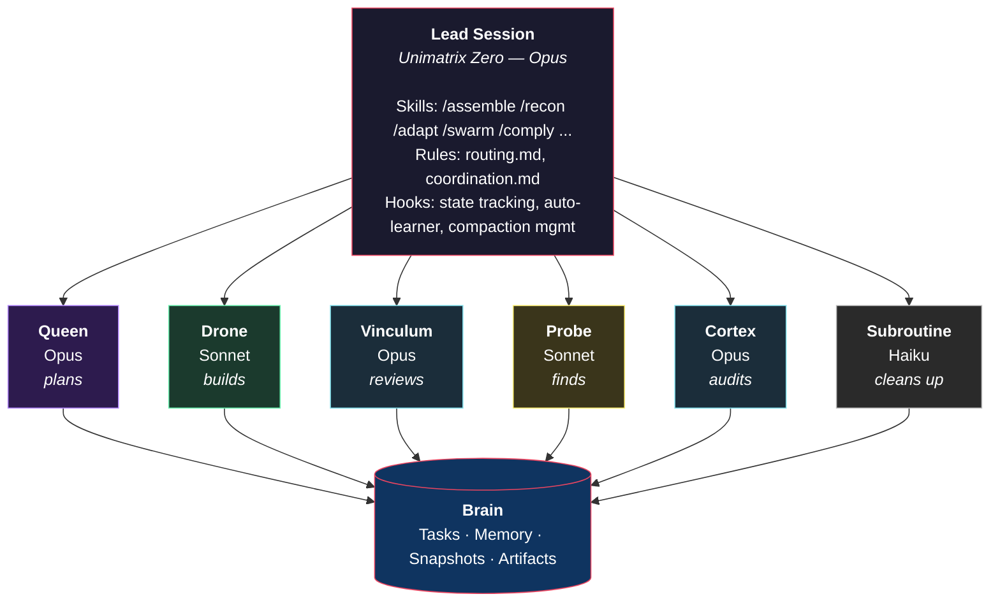
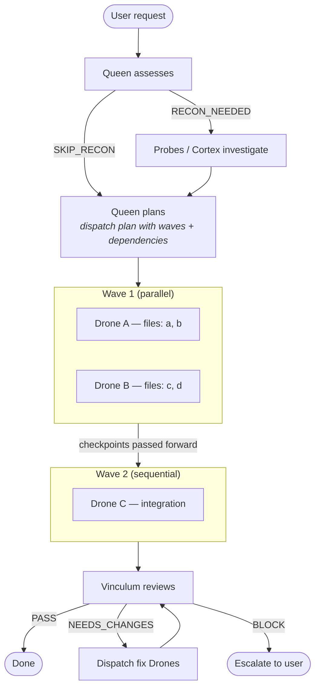
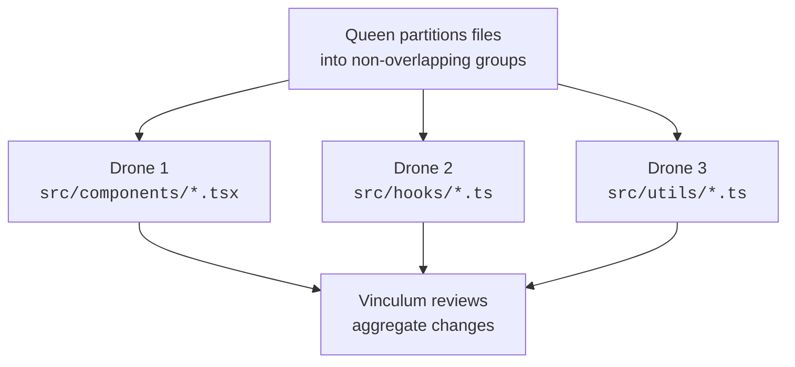

# Unimatrix

A multi-agent orchestration framework for [Claude Code](https://docs.anthropic.com/en/docs/claude-code) that coordinates specialized AI agents to plan, implement, review, and analyze software engineering tasks.

Unimatrix extends Claude Code with a collective of agents — each with a distinct role, model, and set of capabilities — orchestrated through slash commands, event hooks, and persistent task tracking via [Brain](https://github.com/benediktms/brain).

## How It Works

Unimatrix follows a plan-execute-review cycle:

1. **The Queen plans** — decomposes a task into subtasks, sets dependencies, and produces a dispatch plan
2. **The lead session orchestrates** — spawns Drones (and optionally Probes/Cortex) to carry out the plan
3. **Drones implement** — each executes a single well-scoped task, commits changes, and saves a checkpoint
4. **The Vinculum reviews** — validates correctness with evidence-based verification
5. **The Subroutine cleans up** — commits, closes tasks, writes memory episodes

All task state, checkpoints, and learned patterns are persisted in Brain, enabling work to be resumed across sessions.

## Architecture



### Agents

| Agent | Model | Role |
|-------|-------|------|
| **Queen** | Opus | Strategic planner — decomposes work into brain tasks with dependencies, produces dispatch plans |
| **Drone** | Sonnet | Implementation worker — executes a single well-scoped brain task, commits changes, saves checkpoints |
| **Vinculum** | Opus | Code reviewer — evidence-based verification with tiered reviews (Quick/Standard/Deep) and verdicts (PASS/NEEDS_CHANGES/BLOCK) |
| **Probe** | Sonnet | Codebase scout — finds files, traces code paths, answers structural questions. Fast and shallow |
| **Cortex** | Opus | Deep analyst — architectural audits, security reviews, performance analysis, codebase health. Slow and thorough |
| **Subroutine** | Haiku | Cleanup worker — git commits, documentation sync, brain task closure. Executes explicit instructions only |

Agent definitions live in `agents/` as markdown files with YAML frontmatter that configures model, permission mode, max turns, and allowed/disallowed tools.

### Skills (Slash Commands)

Skills are the primary interface for invoking workflows:

| Skill | Description |
|-------|-------------|
| `/assemble` | End-to-end orchestration: Queen plans, Drones implement (parallel or sequential waves), Vinculum reviews |
| `/recon` | Reconnaissance missions: Queen scopes the investigation, Probes and Cortex agents execute, results linked to brain tasks |
| `/adapt` | Iterative refinement loop: Drone implements, Vinculum reviews, repeat until PASS (default 3 cycles, max 5) |
| `/swarm` | Bulk parallel changes: Queen partitions files into groups (max 5), Drones work in parallel on non-overlapping partitions |
| `/comply` | Code review: invokes Vinculum on uncommitted changes, a branch, a file path, or a brain task |
| `/analyse` | Deep analysis: invokes Cortex for architectural audits, security reviews, or codebase health assessments |
| `/reengage` | Resume execution of a previously planned brain task by dispatching agents to ready subtasks |
| `/assimilate` | End-of-session ritual: captures knowledge, writes memory episodes, prepares context for next session |
| `/designate` | Generates Borg-style agent designations (e.g., "Seven of Nine, Septenary Tactical Adjunct of Trimatrix 712") |

Skill definitions live in `skills/<name>/SKILL.md`.

## Installation

### Prerequisites

- [Claude Code](https://docs.anthropic.com/en/docs/claude-code) CLI
- [Brain](https://github.com/benediktms/brain) — task tracking, memory, and artifact persistence
- Python 3 (for hooks)

### Install

```bash
# Clone the repository
git clone https://github.com/benediktms/unimatrix.git  # or wherever you host it

# Global installation (available in all projects)
./install.sh --global

# Per-project installation
./install.sh --project ~/code/my-project
```

The installer:
- Symlinks `agents/`, `rules/`, and `skills/` into `~/.claude/` (or `<project>/.claude/`)
- Merges Unimatrix settings (spinner verbs, status line, hooks) into your `settings.json`
- Configures `core.hooksPath` for git hooks
- Backs up existing files before overwriting
- Skips project-level `.claude/skills/` when installing OpenCode to the unimatrix repo itself (if Claude Code skills are already installed globally) to prevent duplicate skills

Restart Claude Code after installation to pick up changes.

## Workflows

### `/assemble` — Full Orchestration

The primary workflow for complex, multi-step tasks:



### `/adapt` — Iterative Refinement

For tasks that need multiple passes to converge:


### `/swarm` — Parallel Bulk Changes

For applying the same kind of change across many files:



### `/recon` — Reconnaissance

For understanding a codebase area before making changes:


## Brain Integration

[Brain](https://github.com/benediktms/brain) is the persistence layer that enables coordination across agents and sessions. Unimatrix uses Brain for three core functions:

### Task Management

Brain tracks all work as tasks with dependencies, priorities, and status:

```
Epic: "Implement auth system"
├── Task 1: "Add JWT middleware" (ready)
├── Task 2: "Create login endpoint" (blocked by 1)
├── Task 3: "Add session store" (blocked by 1)
└── Task 4: "Integration tests" (blocked by 2, 3)
```

- The **Queen** creates epics and subtasks with dependencies via `tasks_apply_event`
- **Drones** mark tasks `in_progress`, add comments, and report completion
- `tasks_next` returns the highest-priority unblocked tasks
- `tasks_close` closes completed tasks and unblocks dependents

### Snapshots and Artifacts

Brain stores checkpoints and artifacts that enable context flow between agents:

| What | Who Creates | Purpose | Tags |
|------|-------------|---------|------|
| Drone checkpoints | Drone | Pass context to subsequent waves | `drone-checkpoint`, `parent:<task-id>` |
| Implementation artifacts | Drone | Permanent record of what changed | `drone-implementation` |
| Queen plans | Queen | Plan record before execution | `queen-plan` |
| Probe findings | Probe | Recon results linked to tasks | `probe-recon` |
| Cortex analyses | Cortex | Structured analysis reports | `cortex-analysis` |
| Vinculum reviews | Vinculum | Review verdicts and evidence | `vinculum-review` |

**Cross-wave context flow:** When Drones in Wave 1 complete, the lead extracts their snapshot IDs and passes them to Wave 2 Drones via `PRIOR CHECKPOINTS: <id1>, <id2>` in the prompt. This enables context handoff without the lead relaying full file contents.

### Memory

Brain's semantic memory enables knowledge persistence across sessions:

- `memory_write_episode` — Records structured episodes (goal, actions, outcome) with tags and importance
- `memory_search_minimal` — Semantic search with intent-aware ranking (lookup, planning, reflection, synthesis)
- `memory_expand` — Fetches full content from search stubs

The auto-learner system (see Hooks below) uses memory to capture and replay error/fix patterns automatically.

## Hooks

Unimatrix hooks into Claude Code's event system for automatic state management. All hooks are Python scripts in `hooks/`.

### State Tracking

| Hook | Event | Purpose |
|------|-------|---------|
| `track-agents.py` | SubagentStart/Stop | Tracks active subagents per session (type, duration, count) |
| `track-cost.py` | SubagentStop | Parses transcripts for token usage, calculates cost per agent tier |
| `track-compactions.py` | PreCompact | Counts context window compactions per session |

### Compaction Management

Claude Code compacts (summarizes) the conversation when the context window fills up. Unimatrix preserves critical state across compactions:

| Hook | Event | Purpose |
|------|-------|---------|
| `checkpoint-state.py` | PreCompact | Captures open tasks, active agents, and costs; saves as brain snapshot and temp file |
| `inject-checkpoint.py` | UserPromptSubmit | Injects the saved checkpoint into the next prompt after compaction (one-shot) |
| `warn-compaction.py` | PostToolUse | Estimates token usage and warns at 70%/85% thresholds before compaction hits |

### Auto-Learner

The auto-learner captures error/fix patterns and replays them in future sessions:

| Hook | Event | Purpose |
|------|-------|---------|
| `learner-track.py` | PostToolUse | Detects tool failures, then watches for successful follow-ups. Scores error/fix pairs and persists high-confidence patterns to brain memory |
| `learner-inject.py` | UserPromptSubmit | Searches brain for auto-learned patterns matching pending errors, injects matching fixes as context |

### Other

| Hook | Event | Purpose |
|------|-------|---------|
| `greeting.sh` | SessionStart | Displays a Borg-themed ASCII greeting |
| `post-commit` | Git post-commit | Re-runs `install.sh --global` to keep symlinks in sync after changes |

### Status Line

`statusline.py` renders a custom Claude Code status line showing active agents (color-coded by type), elapsed durations, compaction count, and session cost.

## Coordination Patterns

### Parallel Execution

When plan steps are independent, multiple Drones run simultaneously:

- **File-partitioned:** Each Drone gets a non-overlapping set of files. No worktree isolation needed — all commit directly to the current branch.
- **Worktree-isolated:** When Drones might touch overlapping files, each runs in an isolated git worktree. The lead squash-merges branches between waves.

### Sequential Execution

When steps have dependencies, Drones run one at a time. Prior checkpoint IDs flow forward via `PRIOR CHECKPOINTS:` in the prompt.

### Mixed-Mode

Most real plans mix both: parallel foundation waves, sequential integration steps, parallel finishing work. The Queen's dispatch plan specifies the wave structure.

### Error Handling

- If a Drone fails, it marks the task `blocked` and reports to the lead
- The lead does not retry with the same approach — it escalates to the user
- If the Vinculum finds critical issues, the lead dispatches new Drones with specific fix instructions

## Project Structure

```
unimatrix/
├── agents/                    # Agent definitions
│   ├── queen.md              #   Strategic planner (Opus)
│   ├── drone.md              #   Implementation worker (Sonnet)
│   ├── vinculum.md           #   Code reviewer (Opus)
│   ├── probe.md              #   Codebase scout (Sonnet)
│   ├── cortex.md             #   Deep analyst (Opus)
│   └── subroutine.md         #   Cleanup worker (Haiku)
├── skills/                    # Slash command skills
│   ├── assemble/SKILL.md    #   End-to-end orchestration
│   ├── adapt/SKILL.md       #   Iterative refinement
│   ├── swarm/SKILL.md       #   Parallel bulk changes
│   ├── recon/SKILL.md       #   Reconnaissance missions
│   ├── comply/SKILL.md      #   Code review
│   ├── analyse/SKILL.md     #   Deep analysis
│   ├── reengage/SKILL.md    #   Resume prior work
│   ├── assimilate/SKILL.md  #   End-of-session cleanup
│   └── designate/SKILL.md   #   Agent naming
├── rules/                     # Process rules
│   ├── routing.md            #   Task → agent routing decisions
│   └── coordination.md      #   Multi-agent coordination patterns
├── hooks/                     # Claude Code event hooks
│   ├── checkpoint-state.py   #   Pre-compaction state capture
│   ├── inject-checkpoint.py  #   Post-compaction state restore
│   ├── warn-compaction.py    #   Token usage warnings
│   ├── learner-track.py      #   Error/fix pattern detection
│   ├── learner-inject.py     #   Learned pattern injection
│   ├── track-agents.py       #   Active agent tracking
│   ├── track-cost.py         #   Token cost tracking
│   ├── track-compactions.py  #   Compaction counting
│   ├── designate.py          #   Borg designation generator
│   ├── greeting.sh           #   Session greeting
│   └── post-commit           #   Auto-reinstall on commit
├── settings.json              # Claude Code config (hooks, spinner, status line)
├── statusline.py              # Custom status line renderer
├── install.sh                 # Symlink installer
├── AGENTS.md                  # Canonical agent reference (includes task management docs)
└── CLAUDE.md                  # Project entry point
```

## Configuration

### `settings.json`

Merged into Claude Code's settings during installation. Configures:

- **Hooks** — Maps Claude Code events to hook scripts
- **Spinner verbs** — Custom Borg-themed loading messages
- **Status line** — Points to `statusline.py` for the custom status bar

### Agent Definitions

Each agent file (`agents/*.md`) uses YAML frontmatter:

```yaml
---
model: opus          # opus | sonnet | haiku
permissionMode: auto # auto | bypassPermissions
maxTurns: 40
disallowedTools:     # Tools this agent cannot use
  - Agent
---
```

### Skill Definitions

Each skill file (`skills/*/SKILL.md`) uses YAML frontmatter:

```yaml
---
description: "Short description shown in /help"
user_invocable: true
---
```

The markdown body contains the full prompt that executes when the skill is invoked.

## Further Reading

- [AGENTS.md](./AGENTS.md) — Canonical agent reference with task management CLI/MCP documentation
- [Brain](https://github.com/benediktms/brain) — The task tracking, memory, and artifact persistence backend
- [Claude Code](https://docs.anthropic.com/en/docs/claude-code) — The CLI that Unimatrix extends
