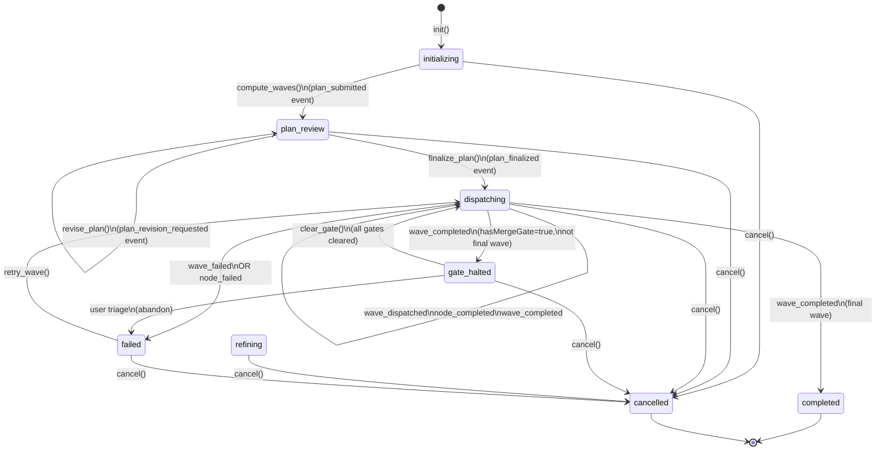
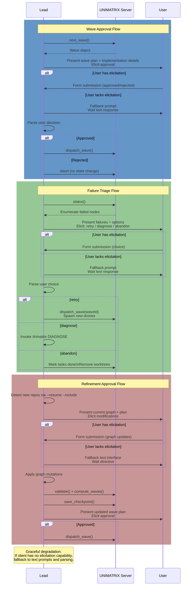

# Trimatrix: Cross-Repository Orchestration

## Overview

Trimatrix orchestrates multi-repository feature development for the collective.
When a feature spans multiple repositories and requires coordinated, staged
deployments — contract-first API definitions, dependent implementations, stacked
PRs with merge gates — the collective deploys trimatrix cross-repo mode.

**What trimatrix does:**

- Decomposes cross-repository features into nodes (branches/PRs) and edges
  (dependencies)
- Computes execution waves via topological sort, respecting merge gates as wave
  boundaries
- Dispatches parallel drones per wave, each working in an isolated git worktree
- Halts at merge gates, awaiting external confirmation before proceeding
- Persists state via checkpoints, enabling resumption across sessions
- Supports refinement — adding repos or recomputing waves mid-execution

**When to use cross-repo mode vs plan-execute:**

- **Plan-execute** — Single repository, arbitrary feature complexity. Deploys
  workflow with drones, sentinel review, task closure.
- **Cross-repo** — Multiple repositories with inter-repo dependencies,
  contract-first patterns, or merge gates. Orchestrates via graph topology, wave
  dispatch, and gate checkpoints.

---

## State Machine

All trimatrix cross-repo executions follow this state machine:



**State descriptions:**

- **`initializing`** — Graph created, no waves computed yet. Call
  `compute_waves` to transition to plan review.
- **`plan_review`** — Wave plan computed and ready for user review. Call
  `finalize_plan` to begin dispatch, or `revise_plan` to iterate on the plan.
- **`dispatching`** — Waves are executing. drones are active or completed.
  Machine loops through `next_wave()`, dispatches, monitors nodes.
- **`gate_halted`** — A wave with `hasMergeGate: true` completed. External PRs
  must be merged before proceeding. Machine waits for `clear_gate()` events.
- **`failed`** — One or more nodes failed. User chooses: retry failed nodes,
  invoke `/trimatrix DIAGNOSE intent`, or abandon.
- **`completed`** — All waves executed, all nodes in terminal state. Clean up
  worktrees and report results.
- **`cancelled`** — Execution cancelled from a non-terminal state. Terminal
  state — no further transitions allowed. User can optionally archive the
  checkpoint.

---

## Dispatch Loop

The wave execution loop drives progress through the topological graph:

```mermaid
flowchart TD
    Start([Get Next Wave]) --> HasWave{next_wave<br/>returned?}

    HasWave -->|null: reason| CheckReason{Reason<br/>type?}
    CheckReason -->|gate_halted| GateHalt["MERGE GATE\nwait for PRs"]
    CheckReason -->|completed| Done["Execution Done\nClean up"]
    CheckReason -->|failed| FailHand["FAILURE HANDLING\nUser triage"]

    HasWave -->|wave object| PresentPlan["Present Wave Plan\nwait user approval"]
    PresentPlan --> UserApproves{Approved?}
    UserApproves -->|No| AbortWave["Abandon Wave"]
    UserApproves -->|Yes| DispatchWave["dispatch_wave<br/>Create worktrees<br/>Create tasks"]

    DispatchWave --> SpawnAdjuncts["Spawn parallel drones\nrun_in_background"]
    SpawnAdjuncts --> MonitorAdjuncts["Monitor completion\nwait all drones"]

    MonitorAdjuncts --> CheckOutcome{Wave<br/>outcome?}

    CheckOutcome -->|all succeeded| ValidationReview["Dispatch sentinel\nreview wave changes"]
    CheckOutcome -->|failures| FailHand

    ValidationReview --> ValCheck{sentinel<br/>approves?}
    ValCheck -->|Pass| RecordPRs["Create PRs\nrecord prUrl/prNumber"]
    ValCheck -->|Fail| FailHand

    RecordPRs --> PersistCP["Persist checkpoint"]
    PersistCP --> CheckGate{Wave has<br/>merge_gate?}
    CheckGate -->|Yes| GateHalt
    CheckGate -->|No| Start

    GateHalt --> LoopGate["Persist. Halt.\nWait user resume."]
    FailHand --> FailChoice{User<br/>action?}
    FailChoice -->|retry| MonitorAdjuncts
    FailChoice -->|diagnose| Diagnose["Invoke /trimatrix DIAGNOSE"]
    FailChoice -->|abandon| Done

    Done --> [*]
    LoopGate --> [*]
    AbortWave --> [*]
    Diagnose --> FailHand
```

**Key decision points:**

- **Wave approval** — User reviews implementation details before drones execute.
- **sentinel review** — After all nodes in wave complete, sentinel validates
  changes for compliance.
- **Merge gate** — If the completed wave carries `hasMergeGate: true` and is not
  the final wave, execution halts.
- **Failure triage** — User chooses to retry, diagnose, or abandon.

---

## Elicitation Interaction Diagram

Trimatrix integrates with the collective's elicitation capability. Three primary
interaction flows exist:



**Three flows:**

1. **Wave approval** — drones standby until user approves implementation plan.
2. **Failure triage** — On failed nodes, user selects action: retry, diagnose,
   or abandon.
3. **Refinement approval** — When repos are added mid-execution, user reviews
   graph changes before re-dispatch.

**Graceful degradation:**

- If the client lacks elicitation capability (form-based UI), fall back to text
  prompts.
- The Lead parses user intent from text response and proceeds.

---

## Graph Topology

Trimatrix's execution model is a directed acyclic graph (DAG) of nodes and
edges.

### Node Types

**Nodes** represent discrete units of work — one branch/PR per repository:

```typescript
interface Node {
  id: string; // "api-contracts", "service-impl", etc.
  repo: string; // Brain name: "api", "service", etc.
  type: "contract" | "implementation"; // Contract defines API; implementation depends on it
  label: string; // Human description
  worktreeBranch: string; // Git branch: "trimatrix/api-contracts"
  stackedOn?: string; // Node ID this node stacks on (same repo only)
  status: "pending" | "active" | "pr_created" | "merged" | "blocked" | "failed";
}
```

**Status lifecycle (`NodeStatus`):**

- `PENDING` → `ACTIVE` (node dispatched to drone)
- `ACTIVE` → `PR_CREATED` (drone completes, PR created)
- `PR_CREATED` → `MERGED` (PR merged externally)
- `DONE` (node closed without a PR)
- `FAILED` (drone reports failure)
- `BLOCKED` (ELICIT_GATE pending elicitation response)

**Readiness axis (`ReadinessStatus`):** A separate orthogonal field tracking
topology eligibility, independent of `NodeStatus`:

- `READY` — every incoming dependency edge is satisfied; node is eligible for
  dispatch when `PENDING`.
- `BLOCKED` — at least one incoming dependency is unsatisfied; recomputed
  automatically by `recomputeReadiness`.
- `INVALIDATED` — the node's contract changed via refinement after it was
  computed; explicit re-dispatch required.

### Edge Types

**Edges** express dependencies between nodes:

```typescript
interface Edge {
  from: string; // Source node ID
  to: string; // Target node ID
  type: "MERGE_GATE" | "STACKED" | "DEPENDS_ON";
}
```

**`MERGE_GATE` edges** (cross-repo dependencies):

- Target cannot activate until source is `merged`.
- Creates wave boundary — target belongs to a later wave.
- Use when downstream repo depends on released API from upstream repo.
- Example: `api-contracts` → `service-impl` (service depends on API contract).

**`STACKED` edges** (intra-repo sequencing):

- Target branch stacks on top of source branch within the same repo.
- Does NOT create wave boundary — both nodes can be in the same wave.
- Target node's worktree is created from source node's branch, not main.
- Use for sequential changes within one repo.
- Example: `service-impl` → `service-tests` (tests stack on implementation).

**`DEPENDS_ON` edges** (logical dependency, no merge gate):

- Target cannot activate until source reaches a terminal-OK state (`DONE`,
  `MERGED`, or `PR_CREATED`).
- Does NOT create a wave boundary — the engine may place both nodes in the same
  wave if topology allows.
- Use when one node logically depends on another but does not require the source
  to be fully merged before the target branch is created.

### Example Topology

```
Two repositories: api, service.
Feature: Introduce gRPC API.

Nodes:
  contract-defs    [api]           (contract type)
  service-impl     [service]       (implementation type, depends on contract)
  service-tests    [service]       (implementation type, stacks on service-impl)

Edges:
  contract-defs --[merge_gate]--> service-impl   (service waits for API to merge)
  service-impl  --[stacked]-----> service-tests  (tests stack on impl within service)

Waves:
  Wave 1: contract-defs
           hasMergeGate: true (gates service-impl)
  Wave 2: service-impl, service-tests (parallel, both wait for contract-defs to merge)
```

**Wave computation:**

- Assigns topological levels using Kahn's algorithm.
- `merge_gate` edges advance wave level; `stacked` edges do not.
- Nodes at each level form a wave.
- Waves can execute in parallel within themselves; waves execute sequentially
  across.

---

## Session Grouping

Trimatrix groups checkpoints and executions into **sessions**. Each session has
a unique identifier and optional label, enabling discovery and management of
multiple concurrent or historical trimatrix executions.

### Session Identity

**Session ID:** Automatically generated in format `trimatrix-YYYY-MM-DD-XXXX`
(date + 4-digit random suffix).

- Ensures uniqueness across sessions initiated on the same day.
- Returned by `save_checkpoint` and stored in the checkpoint.

**Session Label:** Optional user-provided label or auto-generated from
repository names.

- Example: `api-service-contracts-feature`
- Aids human-readable checkpoint discovery.

### Session Tagging

All checkpoints within a session are tagged with `trimatrix-session:<sessionId>`
during artifact creation (Step 5 of cross-repo mode flow). This enables:

- **Checkpoint grouping:** All checkpoints for a session discoverable via
  `records_list` with the session tag.
- **Session listing:** Call `list_sessions` to retrieve all sessions and their
  associated checkpoints.
- **Organized discovery:** Users can explore concurrent or historical trimatrix
  work without ambiguity.

### Example

```
Session: trimatrix-2026-03-16-a7k2
Label: api-backend-grpc-feature

Checkpoints:
  - artifact-id-001 (checkpoint: graph computed, awaiting user approval)
  - artifact-id-002 (checkpoint: Wave 1 dispatched, drones active)
  - artifact-id-003 (checkpoint: Wave 1 completed, gate_halted, PRs merged)
```

---

## Cancellation

Trimatrix execution can be cancelled gracefully from any non-terminal state.

### Cancel Event

Trigger cancellation via the `cancel` MCP tool with an optional reason string.
The machine transitions immediately to `cancelled` state.

**Key differences from `failed` state:**

- **`failed`** — Transient, recoverable. User can retry failed nodes or abandon.
- **`cancelled`** — Terminal, final. No retry possible. Indicates deliberate
  shutdown.

### Archive

After cancellation, optionally call `archive` with the checkpoint artifact ID to
archive the checkpoint via the brain CLI. Archived checkpoints are removed from
active session listings but retained in the brain record for audit/recovery
purposes.

**Workflow:**

1. Call `cancel` with optional reason → machine enters `cancelled` state.
2. Optionally call `archive` with artifact ID → checkpoint archived.
3. Remove worktrees manually or via cleanup script if desired.

---

## Refinement Flow

Trimatrix supports **refinement** — adding repositories or modifying the graph
mid-execution while preserving completed work.

### When Refinement Triggers

Refinement activates when:

1. **User calls `--resume --include <new-repos>`** — New repos added to
   checkpoint.
2. **User provides additional instructions on resume** — Scope change requested.
3. **User modifies graph explicitly** — Nodes/edges adjusted in refinement mode.

### State Transitions

```
dispatching or gate_halted or failed
    ↓
[Detect new repos or user instruction]
    ↓
refining ← User reviews current graph, applies changes
    ↓
[Validate + compute_waves]
    ↓
dispatching → Continue wave dispatch (or gate_halted if wave has merge gate)
```

### Invariants

- **Completed work is immutable** — Nodes in terminal state (`merged`, `failed`)
  cannot be modified.
- **New nodes can depend on completed nodes** — Edges from new nodes to
  completed nodes are allowed.
- **Partial wave recomputation** — Waves that have completed are preserved;
  remaining topology is recomputed.

### Refinement Example

```
Initial checkpoint:
  Wave 1: api-contracts         → completed
  Wave 2: service-impl          → active (in progress)

User calls: /trimatrix cross-repo --resume --include mobile-client

Refinement:
  1. Detect mobile-client not in checkpoint.repos
  2. Present current graph: highlight api-contracts (done), service-impl (active)
  3. Add new node: client-impl [mobile-client]
  4. Add edge: api-contracts --[merge_gate]--> client-impl
  5. Recompute waves:
     Wave 1: api-contracts       (preserved, completed)
     Wave 2: service-impl        (preserved, active)
     Wave 3: client-impl         (new, depends on api-contracts)
  6. Present updated plan
  7. After user approval, resume dispatch at Wave 2
```

---

## Checkpoint Lifecycle

Trimatrix persists state via checkpoints. Checkpoints are saved as brain
artifacts and can be resumed across sessions.

### Checkpoint Structure

```typescript
interface Checkpoint {
  version: string; // e.g., "1.2.0"
  machineState: MachineState; // current state
  graph: Graph; // nodes and edges
  waves: Wave[]; // computed topological waves
  currentWaveId: number | null; // active wave ID
  repos: RepoMetadata[]; // target repositories
  waveHistory: WaveResult[]; // completed/failed wave results
  sessionId: string; // trimatrix-YYYY-MM-DD-XXXX format
  sessionLabel?: string; // user-provided or auto-generated label
  createdAt: string; // ISO 8601
  updatedAt: string; // ISO 8601
  epicTaskId?: string; // brain task ID if materialized
  cancellationReason?: string; // reason for cancellation (if cancelled)
  cancelledAt?: string; // ISO 8601 timestamp of cancellation
}
```

### Save Points

Checkpoints are persisted after:

1. **`compute_waves()`** — After graph validation and wave computation.
2. **End of each wave** — After all nodes complete (success or failure).
3. **`clear_gate()`** — After merge gate confirmation.
4. **User refinement** — After graph modifications are approved.

### Version Compatibility

- Current version: `2.6.0`
- Deserialization enforces that the version appears in the supported-versions
  set — unsupported versions abort with a clear error.
- Migration is implemented across the full 1.0.0→2.6.0 ladder. Each version adds
  backward-compat defaults on deserialize (e.g., `refinementHistory` for 1.0.0,
  `repos` for pre-1.2.0, `subgraphs` for pre-2.0.0, `eventLog` for pre-2.6.0).

### Refinement History

Checkpoints track a live `refinementHistory` field:

```typescript
interface Checkpoint {
  // ... existing fields
  refinementHistory: Array<{
    timestamp: string;
    addedNodes: string[];
    addedEdges: Edge[];
    addedRepos: string[];
  }>;
}
```

Each refinement operation appends an entry. This enables audit trails of scope
expansions and is present on all checkpoints from version 1.1.0 onward (1.0.0
checkpoints receive an empty array on deserialize).

---

## CLI Usage

Trimatrix cross-repo mode is invoked via `/trimatrix cross-repo`. All operations
preserve state in the brain checkpoint system.

### Fresh Invocation

```
/trimatrix cross-repo --include <brain-refs>
```

Start a new orchestration with specified target repositories. Launches planning,
graph decomposition, and wave dispatch.

**Arguments:**

- `<brain-refs>` — Comma-separated list: brain names, aliases, or filesystem
  paths. Example: `/trimatrix cross-repo --include api,service,mobile-client`

### Resume from Checkpoint

```
/trimatrix cross-repo --resume [artifact-id | brain-ref]
```

Resume a prior execution. Optionally specify which checkpoint:

- **No argument** — Fetch latest `trimatrix-checkpoint` artifact.
- **Artifact ID** (UUID) — Resume specific checkpoint.
- **Brain ref** (name/alias) — Resume latest checkpoint tagged
  `trimatrix-repo:<ref>`.

**Behavior:**

- Loads checkpoint state and machine state.
- If new brains are specified (via implicit tag match), adds them to context.
- If machine state is `gate_halted`, checks PR merge status before resuming.
- If machine state is `failed`, presents failure triage options.

### Expand Scope on Resume

```
/trimatrix cross-repo --resume --include <additional-repos>
```

Add new repositories to an existing checkpoint. Triggers refinement mode:

1. Load checkpoint.
2. Detect new repos.
3. Present current graph + newly added repos.
4. User specifies new nodes for new repos and dependencies.
5. Recompute waves.
6. Resume dispatch.

### Dry-Run Planning

```
/trimatrix cross-repo --include <brain-refs> --dry-run
```

Plan and build the graph only. Do not dispatch drones or create worktrees.
Returns:

- Decomposed nodes and edges.
- Computed waves in topological order.
- Wave plan summary.

Useful for validating graph structure before committing to execution.

---

## MCP Tools Reference

The UNIMATRIX MCP server exposes the following tools. All require an initialized
checkpoint except `init` and `restore_checkpoint`.

| Tool                       | Purpose                                                                                                        |
| -------------------------- | -------------------------------------------------------------------------------------------------------------- |
| `init`                     | Initialize empty checkpoint in `initializing` state with repo metadata.                                        |
| `add_repo`                 | Add repo to existing checkpoint. No-op if already present.                                                     |
| `add_node`                 | Add node to graph (id, repo, type, label, worktreeBranch, stackedOn?).                                         |
| `add_edge`                 | Add directed edge: `from`, `to`, `type` (MERGE_GATE \| STACKED \| DEPENDS_ON).                                 |
| `validate`                 | Check graph integrity: edge refs, stackedOn refs, cycle detection (Kahn).                                      |
| `compute_waves`            | Compute topological waves, transition to `plan_review`. Validate first.                                        |
| `finalize_plan`            | Transition from `plan_review` to `dispatching` after user review.                                              |
| `revise_plan`              | Request plan revision while in `plan_review`; remains in `plan_review`.                                        |
| `refine`                   | Enter `refining` state to add nodes/edges/repos mid-execution. Call `compute_waves` when done.                 |
| `compute_subgraphs`        | Derive subgraph partitions from the current node graph.                                                        |
| `add_subgraph`             | Declare an explicit subgraph with a stable user-supplied slug, policies, and coordination contracts.           |
| `list_subgraphs`           | List all subgraphs (derived and explicit) with their current status.                                           |
| `get_subgraph`             | Return full details for a single subgraph by ID.                                                               |
| `dispatch_wave`            | Activate all nodes in a wave, set currentWaveId. Consults brain for external blockers when nodes have taskIds. |
| `complete_node`            | Mark node complete. Optionally record prUrl and prNumber.                                                      |
| `update_node`              | Update mutable fields on a node (label, worktreeBranch, taskId, etc.).                                         |
| `close_node`               | Close a node and its associated brain task.                                                                    |
| `fail_node`                | Mark node failed with human-readable reason.                                                                   |
| `clear_gate`               | Clear merge gate on blocked node. Auto-advances to `dispatching` if all gates cleared.                         |
| `next_wave`                | Return next ready wave, or null with reason.                                                                   |
| `next_frontier`            | Return all PENDING+READY nodes across wave boundaries (advisory; `dispatch_wave` is authoritative).            |
| `add_external_blocker`     | Add an external blocker to the brain task associated with a graph node.                                        |
| `resolve_external_blocker` | Resolve an external blocker on the brain task associated with a graph node.                                    |
| `status`                   | Return full state dump: machineState, nodes, edges, waves, waveHistory.                                        |
| `rename_session`           | Update the session label of the active in-memory graph.                                                        |
| `save_checkpoint`          | Serialize checkpoint to JSON string for persistence. Optionally captures runtime state files.                  |
| `restore_checkpoint`       | Deserialize JSON and load as current checkpoint.                                                               |
| `cancel`                   | Cancel execution. Transitions to cancelled state. Accepts optional reason.                                     |
| `complete`                 | Complete execution. Transitions to completed state and persists a final checkpoint.                            |
| `archive`                  | Archive a checkpoint artifact. Requires completed or cancelled state.                                          |
| `list_sessions`            | List all trimatrix sessions grouped by session ID.                                                             |
| `reflect_session`          | Gather session episodes and return reflection source material for synthesis.                                   |
| `designate`                | Generate Borg-style designations for one or more agents.                                                       |
| `resolve_brains`           | Resolve brain references (ID, name, alias, path) to registry entries. Auto-initializes unregistered paths.     |
| `brain_id`                 | Return the brain ID and name for the current working directory or a specified path.                            |
| `brain_link`               | Link a directory as an additional root for an existing brain (e.g., after creating a worktree).                |

---

## Execution Examples

### Example 1: Simple Contract-First Feature

```
Goal: Introduce gRPC service API.
Repositories: api (proto definitions), backend (service implementation).

/trimatrix cross-repo --include api,backend

Step 1: Plan
  User describes: "Define gRPC API in api repo, implement in backend."

Step 2: Graph
  Nodes:
    - grpc-defs [api] (contract)
    - grpc-impl [backend] (implementation)
  Edges:
    - grpc-defs --[merge_gate]--> grpc-impl

Step 3: Waves
  Wave 1: grpc-defs (hasMergeGate: true)
  Wave 2: grpc-impl (waits for grpc-defs merge)

Step 4: Dispatch
  Wave 1: drone in api worktree defines .proto files, creates PR.
          User merges PR externally.
          Lead checks merge status, clears gate.
  Wave 2: drone in backend worktree implements service, creates PR.
          sentinel reviews changes.
          All done.
```

### Example 2: Multi-Repo with Stacked Changes

```
Goal: Add observability feature spanning multiple repos.
Repositories: shared-lib, service-a, service-b.

/trimatrix cross-repo --include shared-lib,service-a,service-b

Nodes:
  - observability-lib [shared-lib] (contract)
  - service-a-tracing [service-a] (implementation)
  - service-a-tests [service-a] (tests, stacks on service-a-tracing)
  - service-b-tracing [service-b] (implementation)

Edges:
  - observability-lib --[merge_gate]--> service-a-tracing
  - service-a-tracing --[stacked]--> service-a-tests
  - observability-lib --[merge_gate]--> service-b-tracing

Waves:
  Wave 1: observability-lib (hasMergeGate: true)
  Wave 2: service-a-tracing, service-b-tracing (parallel, await lib merge)
  Wave 3: service-a-tests (stacks on Wave 2's service-a-tracing)
```

### Example 3: Mid-Execution Scope Expansion

```
Initial: /trimatrix cross-repo --include api,backend

Execution reaches Wave 2, backend implementation underway.

User: "We also need web client support. Can we add it?"

Lead: /trimatrix cross-repo --resume --include web-client

Refinement:
  Current graph: api-contracts (done), backend-impl (active)
  New repo: web-client (added)
  User adds: web-client-impl [web-client] (implementation, depends on api-contracts)
  New wave plan computed.
  After approval, backend-impl completes, then web-client-impl dispatches.
```

---

## Comparison: Cross-Repo Mode vs Plan-Execute Mode

| Aspect                    | Cross-Repo Mode                     | Plan-Execute Mode                      |
| ------------------------- | ----------------------------------- | -------------------------------------- |
| **Scope**                 | Multiple repositories               | Single repository                      |
| **Graph**                 | Explicit DAG, topological waves     | Tasks tree, sequential/parallel chains |
| **Cross-repo dependency** | merge_gate edges                    | Implicit (via PR interdependencies)    |
| **Pause points**          | Merge gates (external confirmation) | sentinel reviews (internal validation) |
| **Refinement**            | Mid-execution repo additions        | Task creation/re-planning              |
| **Stacking**              | Native: stacked edges               | Manual: rebase management              |
| **Checkpoint**            | Persisted DAG state                 | Brain task tree                        |

**Use cross-repo mode when:**

- Feature spans 2+ repositories.
- Merge gates are needed (external PR coordination).
- Graph topology is explicit (contract-first patterns).
- Stacked PRs within repos.

**Use plan-execute when:**

- Single repository.
- Sequential/parallel task chains.
- Internal sentinel validation sufficient.
- Task-based decomposition fits workflow.

---

## Explicit Subgraphs in Cross-Repo Flows

<context strategy="COORDINATED">
  The supergraph is partitioned into subgraphs that share a coordination
  contract (`exports`, `imports`, `dependsOn`). By default those subgraphs
  are derived automatically by `compute_subgraphs`.
</context>

<recipe name="declare-coordination-contracts" optional="true">
  <when>
    Coordination contracts are known before execution — e.g., a contract
    node exports a proto definition and implementation nodes import it.
  </when>
  <action>
    Declare per-repo explicit subgraphs via `mcp__unimatrix__add_subgraph`
    before calling `compute_subgraphs`.
  </action>
  <benefits>
    <benefit>Encodes the coordination contract up-front rather than letting it be inferred.</benefit>
    <benefit>Each subgraph gets a stable user-supplied slug, independent of node membership changes in sibling subgraphs.</benefit>
    <benefit>`failurePolicy: BEST_EFFORT` and `completionPolicy: GATED` can be applied precisely to nodes that carry cross-repo gate obligations.</benefit>
  </benefits>
  <verify tool="mcp__unimatrix__list_subgraphs">
    Inspect the resulting derived/explicit partition before dispatch.
  </verify>
  <reference path="src/skills/trimatrix/SUBGRAPHS.md"/>
</recipe>

---

## Troubleshooting

### "Cycle detected in graph"

The DAG has a cycle. Check edge definitions for circular dependencies.

Fix: Review edges, ensure no node transitively depends on itself.

### "No next wave available"

All available waves have unmet dependencies. Check:

- Are upstream `merge_gate` nodes in `merged` state?
- Are upstream `stacked` nodes in `pr_created` or `merged` state?

If a wave is stuck, use `/trimatrix cross-repo --resume` and triage via failure
handling.

### "Machine is gate_halted"

External PRs must be merged. Use `/trimatrix cross-repo --resume` to check PR
status and clear gates.

### "Execution failed"

One or more drones reported failure. The machine entered `failed` state.
Options:

- **retry** — Re-dispatch failed nodes.
- **diagnose** — Invoke `/trimatrix DIAGNOSE` with failure logs.
- **abandon** — Close tasks, tear down worktrees, preserve results.

---

## Per-Node Convergence in Cross-Repo Sagas

Cross-repo sagas apply the same convergence loop (Protocol C §§ C1–C8 in
`SKILL.md`) per node that single-repo plan-execute sagas do. Each node carries
`iterationCount`, `maxIterations`, `lastReviewVerdict`, and `lastReviewNotes`
fields regardless of how many repositories the saga spans.

### Convergence Semantics Across Repos

- A node in repo A and a node in repo B each run their own independent implement
  → review → fix loop.
- Wave dispatch does not reset `iterationCount`. A node that was mid-loop at
  saga interruption retains its count across the checkpoint boundary.
- Sentinel review happens per node after that node's drone completes work,
  consistent with the single-repo convergence contract.

### Mid-Loop Resume Rule

When a saga is interrupted (session crash, gate halt, user pause) while a node
is mid-convergence, RESUME must pick up at the correct iteration:

**Rule:** A node with `iterationCount = N` (N > 0) and
`lastReviewVerdict: "FAIL"` at checkpoint time resumes at iteration `N + 1`. The
lead dispatches a fix adjunct carrying `lastReviewNotes` from the prior
sentinel. The convergence loop (C1 steps 4–7) continues from that point.

**The node is NOT re-dispatched from scratch** (i.e., from C1 step 1). Prior
implementation work is preserved in the node's worktree branch.

This satisfies success criterion #3 of unm-735: _"Resuming a saga via `--resume`
picks up mid-loop on the failing node, not from scratch."_

### Cross-Repo Resume Example

```
Saga: 5 nodes across 2 brains (brain-A, brain-B).

Nodes:
  - api-contracts   [brain-A]  DONE         (iteration 1, PASS)
  - svc-impl        [brain-A]  ACTIVE        iterationCount=2, lastReviewVerdict="FAIL"
  - svc-tests       [brain-A]  PENDING (BLOCKED on svc-impl)
  - client-types    [brain-B]  DONE         (iteration 1, PASS)
  - client-impl     [brain-B]  PENDING (READY — awaiting Wave 3)

Saga interrupted while svc-impl is mid-loop at iteration 2.

Resume action:
  /trimatrix --resume

Lead restores checkpoint. machineState = dispatching.
svc-impl has iterationCount=2, lastReviewVerdict="FAIL".

→ Lead enters Protocol C § C1 at step 5 (fix-adjunct dispatch).
→ Fix adjunct receives lastReviewNotes from iteration 2 sentinel.
→ On PASS at iteration 3: svc-impl → DONE.
→ svc-tests unblocks. Wave continues.
→ Wave 3: client-impl dispatches from scratch (iterationCount=0, no prior review).

Corner case — iteration 3 also FAILs:
→ iterationCount reaches maxIterations (default 3).
→ Server auto-fails svc-impl: fail_node(reason: "iteration cap exhausted").
→ svc-tests readinessStatus set to BLOCKED; blockedBy=[svc-impl].
→ Downstream nodes dependent on svc-tests are not directly modified —
  readiness is recomputed by topology traversal.
→ Saga continues for non-dependent nodes (client-impl proceeds if READY).
→ Lead escalates svc-impl failure to user with lastReviewNotes.
→ User may invoke reset_node to retry or abandon the node.
```

### Invariants

- `iterationCount` persists across checkpoint save/restore. The server never
  resets it on deserialization.
- `reset_node` is the only mechanism that may reset `iterationCount` (when
  called with `resetIterationCount: true`). Resume does not reset it.
- Nodes in terminal state (`DONE`, `MERGED`, `FAILED`) are not re-dispatched by
  resume. Their `iterationCount` and `lastReviewVerdict` are preserved as audit
  data in the checkpoint.
- The iteration cap (`maxIterations`) applies identically in cross-repo and
  single-repo contexts. Cap exhaustion auto-fails the node regardless of which
  repo it belongs to.

### Protocol C Reference

The canonical convergence loop specification is in `SKILL.md` Protocol C:

| Section | Content                                                                                                                                                                                   |
| ------- | ----------------------------------------------------------------------------------------------------------------------------------------------------------------------------------------- |
| C1      | Full implement → verify → review → fix cycle; **mid-loop resume rule**: a node with `iterationCount = N > 0` and `lastReviewVerdict: "FAIL"` resumes at iteration N + 1, not from scratch |
| C2      | Iteration cap (`maxIterations`, default 3; auto-fail on exhaustion)                                                                                                                       |
| C3      | Recovery via `reset_node` (lease bump, optional count reset)                                                                                                                              |
| C4      | Failure isolation invariant (downstream `readinessStatus: BLOCKED` on fail)                                                                                                               |
| C5      | Checkpoint cadence (save before each fix-adjunct dispatch for durable mid-loop RESUME)                                                                                                    |
| C6      | Review tier selection (TRIVIAL / NON_TRIVIAL; per-saga team-review budget: max 5)                                                                                                         |
| C7      | Node state diagram (PENDING → ACTIVE → REVIEWING → ...)                                                                                                                                   |
| C8      | MCP primitives (`review_passed`, `review_failed`, etc.)                                                                                                                                   |
| C9      | Post-completion summary (mandatory after each terminal node)                                                                                                                              |
| C10     | Saga report (post-saga aggregate)                                                                                                                                                         |

---

## Implementation Details

### Wave Computation Algorithm

Trimatrix uses **Kahn's topological sort** with wave level assignment:

1. Compute in-degree for all edges.
2. Process nodes in topological order.
3. Propagate wave level: `merge_gate` edges advance level by 1; `stacked` edges
   do not.
4. Group nodes by final level to form waves.
5. Mark waves with `hasMergeGate: true` if any `merge_gate` edge originates from
   that level.

Result: topologically sorted waves, with merge gates as hard boundaries.

### State Machine Transitions

Strict state validation ensures:

- `plan_approved` only valid in `initializing`.
- Wave operations only valid in `dispatching`.
- `gate_cleared` only valid in `gate_halted`.
- `retry_wave` only valid in `failed`.

Illegal transitions throw an error. No silent state drift.

### Persistence & Recovery

- Checkpoints serialized to JSON, saved as brain artifacts.
- Tagged with `trimatrix-checkpoint` for discovery.
- Tagged with `trimatrix-repo:<name>` per repo for targeted resume.
- On resume, deserialize and validate version match.
- If version mismatch, abort with clear error (prevents silent data corruption).
